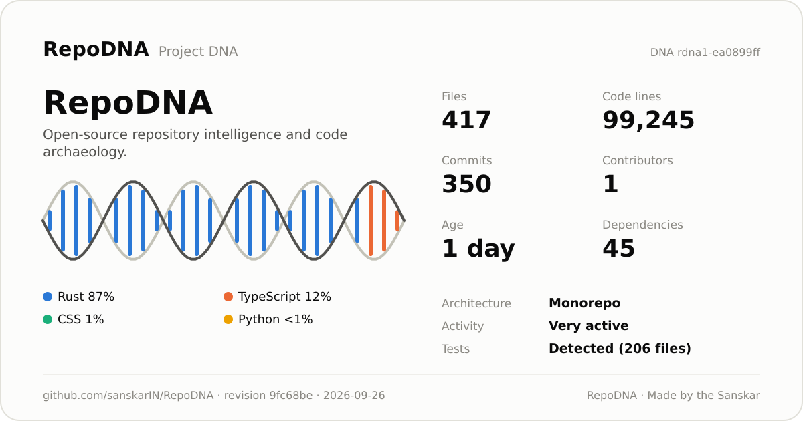
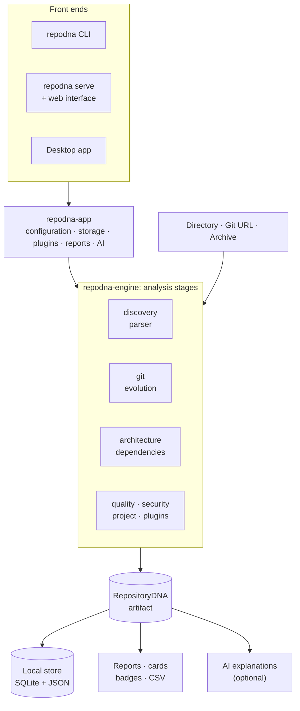
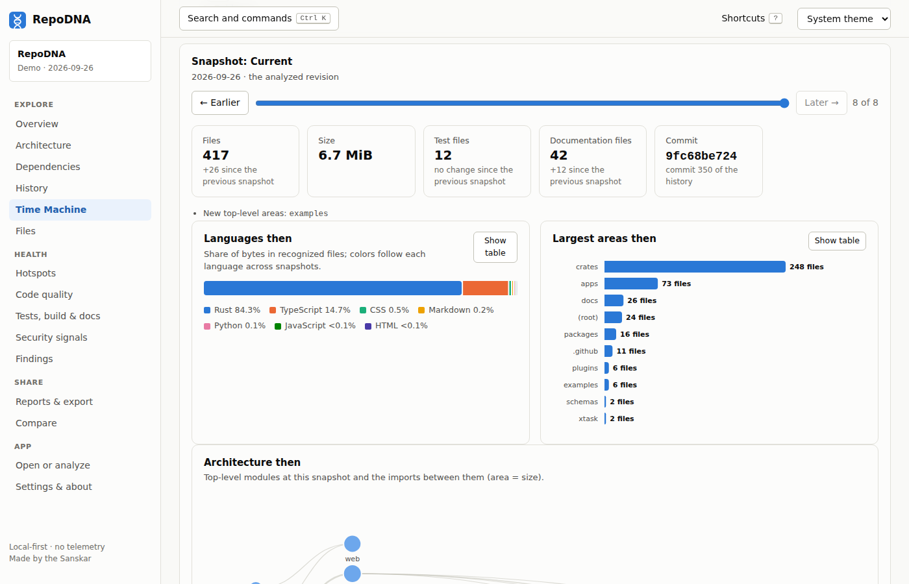
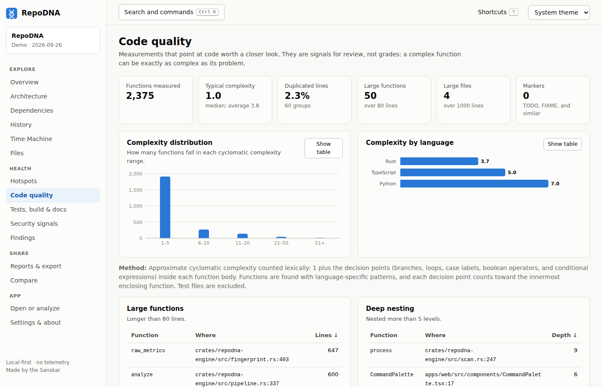
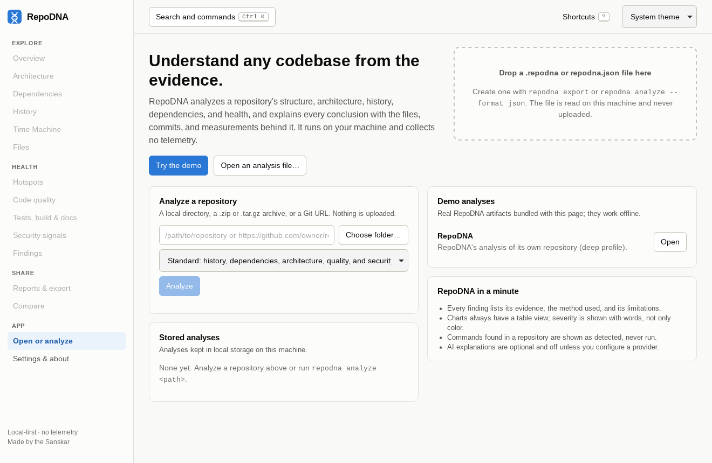
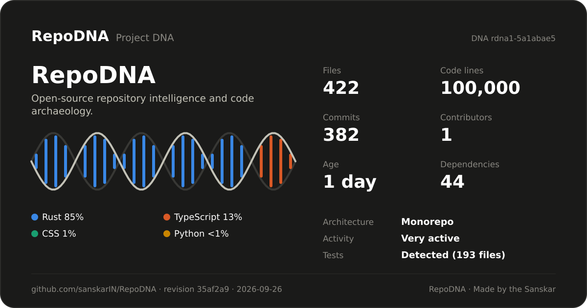
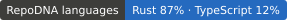
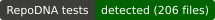
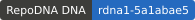

<div align="center">

# RepoDNA

**Understand your codebase. See its DNA.**<br>
Trace its history. Explore its architecture.

[](https://github.com/sanskarIN/RepoDNA/actions/workflows/ci.yml)
[](LICENSE)
[](docs/privacy.md)



<sub>RepoDNA's own Project DNA card, made with <code>repodna card</code>.</sub>

</div>

RepoDNA is an open-source, local-first repository intelligence and code archaeology platform
that turns software repositories into interactive architecture maps, historical timelines,
evidence-backed analysis, and shareable Project DNA reports.

Point it at a directory, an archive, or a Git URL. It tells you how the code is organized,
what depends on what, how the project grew, where change concentrates, how it is built and
tested, and what deserves a closer look, and for every conclusion it shows the files,
lines, commits, and measurements behind it. It runs on your machine, needs no account, and
sends nothing anywhere unless you ask it to.

**[Install](#installation) · [Quick start](#quick-start) · [Demo](#demo) ·
[Documentation](docs/index.md) · [Contributing](CONTRIBUTING.md)**

## Contents

- [Demo](#demo)
- [Why RepoDNA exists](#why-repodna-exists)
- [Features](#features)
- [Architecture](#architecture)
- [Installation](#installation)
- [Quick start](#quick-start)
- [Command-line examples](#command-line-examples)
- [Screenshots](#screenshots)
- [Project DNA cards and badges](#project-dna-cards-and-badges)
- [Supported languages](#supported-languages)
- [Privacy](#privacy)
- [AI explanations (optional)](#ai-explanations-optional)
- [Performance](#performance)
- [Configuration](#configuration)
- [Plugins](#plugins)
- [Development](#development)
- [Testing](#testing)
- [Contributing](#contributing)
- [Security](#security)
- [Roadmap](#roadmap)
- [License](#license)
- [Creator and support](#creator-and-support)

## Demo

The web interface ships with a demo: RepoDNA's analysis of its own repository. It works
offline and needs no repository of your own.

```sh
repodna serve
```

Open the link it prints and choose **Try the demo**.


Without installing anything, you can read what RepoDNA writes about itself in
[`examples/self-analysis`](examples/self-analysis): the full
[Markdown report](examples/self-analysis/report.md), the Project DNA card, and README
badges.

## Why RepoDNA exists

Joining a project, reviewing a dependency, auditing an inherited codebase, or preparing a
refactoring all start with the same questions. How is this organized? What depends on
what? Where does it start? How is it built and tested? Who worked on which part, and what
keeps changing? How did it get this way?

The answers are in the repository, spread across thousands of files and years of history.
Tools that summarize them often hand out scores without saying how they were computed.
RepoDNA answers with evidence instead:

- **Evidence first.** Every finding names the files, lines, commits, or measurements behind
  it, how it was measured, what the measurement cannot see, and what to do next.
  Confidence (how sure RepoDNA is) and severity (how much it matters) are kept apart.
- **Honest about depth.** The analysis is lexical, not compiler-level, and every language is
  labeled with the depth of analysis behind it. Missing data is reported as missing, never
  as zero.
- **Descriptive, not judgmental.** The DNA fingerprint describes a repository; it is not a
  grade. Contributor statistics describe the recorded history, not anyone's value.
- **Local-first and private.** No telemetry, no uploads, and no network use except what you
  ask for.
- **Safe with code you do not trust.** Analysis is read-only, Git runs with hardened
  settings, archives are extracted with limits, and nothing from the repository is executed
  unless you enable it.
- **Deterministic.** The same revision and configuration give the same results.

## Features

**Structure and languages.** 65 built-in [languages](#supported-languages), with each file
classified as source, test, generated, vendored, documentation, configuration, and so on
(`.gitattributes` and your own rules are honored). Lines of code, comments, symbols,
entry points, and the directory tree.

**Architecture.** Modules inferred from package manifests and directories, imports
resolved to files and packages, the module dependency graph with layers, cycles, and
centrality, and the overall style (monorepo, layered, modular, monolithic, flat, or mixed)
with a confidence level.

**Dependencies.** Manifests and lockfiles for 10 ecosystems (Cargo, npm, PyPI, Go, Maven and
Gradle, NuGet, RubyGems, Composer, pub, and Swift Package Manager), read offline: declared
and locked packages, lockfile mismatches, duplicate versions, and stale manifests.

**History and code archaeology.** Commits, contributors (with `.mailmap`), ownership,
releases, quiet periods, the history of every file across renames, and change hotspots:
files that change often and are complex.

**The Codebase Time Machine.** Snapshots of the repository at points in its history,
rebuilt from Git without checking anything out, with epochs, notable events, the
architecture at each snapshot (with the deep profile), and the project's story, each
statement marked as a fact or an interpretation.

**Quality signals.** Cyclomatic complexity, long and deeply nested functions, large files,
duplicated and similar code, TODO and FIXME markers, and files that nothing appears to
use.

**Security signals.** 20 rules for committed secrets (recorded by fingerprint, never by
value), 18 rules for risky patterns in code, configuration, CI workflows, and containers,
and file permission checks.

**Tests, build, and documentation.** Test frameworks and test files, build systems and the
commands to run, CI providers, and documentation checks. Build and test commands can be
run only if you enable execution in your own configuration.

**Reports and sharing.** Self-contained HTML reports in four themes, Markdown, JSON, and
CSV; Project DNA cards (SVG and PNG) and README badges; onboarding guides for new
developers; side-by-side comparisons; portable `.repodna` exports; and privacy presets
that remove contributor names, remote URLs, and more before you share.

**Three ways to use it.** The `repodna` command line, a local web interface
(`repodna serve`) with search and keyboard shortcuts, and a desktop app, all built on the
same analysis.

**CI.** `repodna ci` fails a job on findings at the severity you choose, compares against a
baseline, and writes GitHub Actions annotations.

**Optional AI explanations.** Explanations in prose, built only from the analysis evidence,
through a local program or an API you configure. Off by default.

**Plugins.** Teach RepoDNA a new language with a data file, or add findings with an analyzer
written in any language.

## Architecture

The analysis produces one versioned artifact, the RepositoryDNA, and everything else reads
it: the terminal views, reports, cards, the web interface, comparisons, and AI
explanations.



RepoDNA is a Rust workspace of focused crates (discovery, parsing, Git, dependencies,
architecture, quality, security, project conventions, evolution, the engine, storage,
reports, AI, and plugins), a React and TypeScript web interface, and a Tauri desktop app.
See [the architecture guide](docs/architecture.md).

## Installation

**Prebuilt binaries.** Download the archive for your platform from the
[releases page](https://github.com/sanskarIN/RepoDNA/releases): Linux (x86_64 and ARM64,
statically linked), macOS (Apple silicon and Intel), or Windows (x86_64). Each is a single
`repodna` program with the web interface built in. For example, on Linux:

```sh
tar -xzf repodna-1.0.0-x86_64-unknown-linux-musl.tar.gz
sudo install -m 0755 repodna-1.0.0-x86_64-unknown-linux-musl/repodna /usr/local/bin/repodna
repodna --version
```

**The desktop app.** Installers for Linux (`.deb`, `.rpm`), macOS (`.dmg`), and Windows
(`.msi`, `.exe`) are attached to each release. See [the desktop app](docs/desktop.md).

**From source**, with Git, a stable [Rust](https://www.rust-lang.org/tools/install)
toolchain, and [Node.js](https://nodejs.org/) 20.19 or newer:

```sh
git clone https://github.com/sanskarIN/RepoDNA.git
cd RepoDNA
npm ci
npm run build -w @repodna/web
cargo install --path crates/repodna-cli --locked
```

Git on your `PATH` is needed for history analysis; everything else works without it. The
binaries and installers are not code-signed; [the installation guide](docs/installation.md)
explains how to verify checksums and open them on macOS and Windows.

## Quick start

```sh
cd ~/src/some-project
repodna analyze                      # analyze and store the result
repodna findings                     # every finding, with its evidence
repodna serve                        # explore it in the browser
repodna report                       # write ./repodna-report/ (HTML, Markdown, JSON, card, CSV)
```

`repodna analyze` prints a summary like this one, for a small service in the `polyglot`
[fixture](fixtures/README.md):

```text
polyglot · revision 540e92db6965 · standard profile

  Tracks parcels from pickup to delivery.

  Files         17 (8 source, 2 test)
  Code lines    146
  Languages     Go 51%, TypeScript 30%, Python 10%, SQL 6%
  History       3 commits by 2 contributors, 2024-01-08 → 2024-03-20
  Architecture  Monorepo (high confidence), 4 modules
  Dependencies  4 declared directly
  Tests         2 test files
  Findings      0 critical · 0 warnings · 2 attention · 9 info
```

Working from a clone of this repository instead:

```sh
git clone https://github.com/sanskarIN/RepoDNA.git
cd RepoDNA
npm ci                                              # web interface dependencies
npm run build -w @repodna/web                       # the web interface, embedded in the binary
cargo build --release -p repodna-cli                # the repodna binary
cargo test --workspace && npm test                  # the tests
./target/release/repodna scan /path/to/repository   # analyze a repository
./target/release/repodna report /path/to/repository --format html -o report.html
```

The [getting started guide](docs/getting-started.md) walks through all of it in five
minutes.

## Command-line examples

```sh
repodna scan .                                     # analyze (scan is an alias of analyze)
repodna analyze https://github.com/sanskarIN/RepoDNA   # clone to a temporary directory
repodna analyze project.zip --profile deep         # archives too; deep adds duplication and more
repodna report . --format html -o report.html      # one self-contained HTML page
repodna report . -o report                         # a bundle: HTML, Markdown, JSON, card, CSV
repodna analyze . --format json > repodna.json     # the complete artifact as JSON
repodna card . -o dna-card.svg                     # the Project DNA card
repodna architecture .                             # modules, dependencies, layers, cycles
repodna hotspots .                                 # files that change often and are complex
repodna history .                                  # commits, contributors, releases
repodna timeline .                                 # Time Machine snapshots and the story
repodna show --section summary,tests,build         # any report section in the terminal
repodna compare ./repo-a ./repo-b                  # side by side, without ranking
repodna onboarding . -o docs/onboarding            # a guide for new developers
repodna ci . --fail-on warning --format github     # exit code 5 on warnings or worse
repodna export . -o project.repodna                # share an analysis without the code
```

Every command is described in [the CLI reference](docs/cli.md), including exit codes and
environment variables.

## Screenshots

| | |
|---|---|
|  |  |
| **Architecture:** modules in dependency layers; select one to see why it matters. | **History:** activity, contributors, releases, and where work happens. |
|  |  |
| **Time Machine:** snapshots, epochs, events, and the story of the project. | **Code quality:** complexity, size, duplication, and markers. |
|  |  |
| **Tests, build and docs:** how to set up, build, and test the project. | **Desktop app:** the same interface as a native app. |

All screenshots show RepoDNA's analysis of its own repository.

## Project DNA cards and badges

A Project DNA card sums up a repository in one image: size, history, languages as a DNA
helix, architecture style, activity, tests, and the DNA hash that identifies the analyzed
snapshot. It is an SVG that renders anywhere, or a PNG for social previews.

```sh
repodna card                        # dna-card.svg
repodna card --dark -o card.svg     # dark theme
repodna card --format png           # dna-card.png, at twice the size
repodna badge -o docs/badges        # languages, architecture, activity, tests, and DNA badges
```

<p align="center">

</p>

Badges generated for this repository:

[](examples/self-analysis/report.md)
[](examples/self-analysis/report.md)
[](examples/self-analysis/report.md)
[](examples/self-analysis/report.md)

Cards and badges show the analysis, never the code; `repodna card --privacy public` also
leaves out the repository's remote URL. See [DNA cards](docs/dna-cards.md).

## Supported languages

65 languages are built in. Each is labeled with the depth of analysis behind it, and
[plugins](docs/plugins.md#language-definitions) can add more.

**Lexical analysis** (lines, comments, imports, symbols, and complexity), 25 languages:
C, C#, C++, Dart, Elixir, Go, Groovy, Java, JavaScript, Kotlin, Lua, Objective-C, Perl, PHP,
PowerShell, Python, R, Ruby, Rust, Scala, Shell, Solidity, SQL, Swift, and TypeScript.

**Line counting** (code, comment, and blank lines), 40 languages:

| Kind | Languages |
|---|---|
| Programming | Assembly, Batchfile, Clojure, Erlang, F#, Fortran, Haskell, Julia, OCaml, Shader (GLSL/HLSL), Visual Basic |
| Markup and styles | HTML, Vue, Svelte, Astro, templates (Handlebars, EJS, ERB, Jinja, Twig, Liquid, Nunjucks), CSS, SCSS, Less |
| Data and configuration | JSON, YAML, TOML, XML, SVG, INI, CSV, Protocol Buffers, GraphQL, HCL / Terraform, Nix, Jupyter Notebook |
| Documentation | Markdown, reStructuredText, AsciiDoc, TeX, plain text |
| Build | Dockerfile, Makefile, CMake, Starlark |

Lexical analysis reads tokens, not syntax trees: it is fast and works on code that does not
compile, but imports computed at run time, macros, and reflection are invisible to it.
Imports are resolved to files for relative paths, Rust crates and modules, Python packages,
Go modules, JVM packages, C# and PHP namespaces, workspace packages, and common aliases.
See [the analysis engine](docs/analysis-engine.md).

## Privacy

- **No telemetry.** RepoDNA collects no usage data, crash reports, or analytics, and has no
  code that could.
- **No uploads.** Analyses, reports, and cards are local files. Nothing is published unless
  you publish it.
- **The network is used only when you ask:** to clone a Git URL you give it, and to reach
  an AI provider you configured (endpoints off your machine need your explicit consent).
- **No secret values are stored.** Possible credentials are recorded by rule, file, line,
  and fingerprint.
- **No absolute local paths in artifacts.** Paths are relative to the repository.
- **Sharing presets.** `--privacy share` removes commit messages, the text of TODO-style
  comments, and command output; `--privacy public` also replaces contributor names with pseudonyms and removes
  remote URLs and symbol names.
- **A local server that stays local.** `repodna serve` listens on 127.0.0.1 only and
  requires a session token.

Where everything is stored, and how to delete it: [privacy](docs/privacy.md).

## AI explanations (optional)

The analysis never needs AI. If you want explanations in prose, `repodna explain` sends a
selection of evidence from the analysis (never your whole code base) to a provider you
configure in your user configuration:

| Provider | What it is |
|---|---|
| `none` | The default: AI features are off. |
| `command` | A program on your machine that reads the prompt on standard input, such as `ollama run llama3.2`. |
| `openai-compatible` | Any OpenAI-compatible server: local runtimes (Ollama, llama.cpp, LM Studio, vLLM) or hosted services. |
| `anthropic` | The Anthropic Messages API. |

```sh
repodna explain --dry-run                  # show exactly what would be sent, and send nothing
repodna explain --about architecture       # explain one area of the analysis
```

Answers cite the evidence they are based on, record the provider, model, and token use, and
never replace the analysis itself. Remote endpoints are refused unless you allow them with
`privacy.remote_ai = true` or `--allow-remote-ai`; API keys are read only from an
environment variable you name. A repository's own configuration can never turn AI on. See
[AI](docs/ai.md).

## Performance

RepoDNA is written in Rust, reads each file once, parses files in parallel, streams Git
history in one pass, and caches per-file results between runs. Median times for a full
analysis without the cache, measured on Linux with 4 logical CPUs (see
[the benchmarks](benchmarks/README.md) for the method and every fixture):

| Repository | Files | Code lines | Commits | quick | standard | deep |
|---|---:|---:|---:|---:|---:|---:|
| Fixture `large` | 5,004 | 28,351 | 120 | 0.14 s | 0.76 s | 1.43 s |
| RepoDNA itself | 361 | 93,820 | 264 | 0.17 s | 0.59 s | 1.12 s |

`quick` reads the files only; `standard` adds history, dependencies, architecture, quality,
and security; `deep` adds duplication, similarity, and the architecture at every Time
Machine snapshot. Very large histories can be limited with `--max-commits`. Your numbers
will depend on the machine, the disk, and the size of the history.

## Configuration

RepoDNA works without configuration. To adjust it, `repodna init` writes a commented
`repodna.toml` into a repository:

```toml
[analysis]
profile = "standard"              # quick, standard, or deep

[ignore]
patterns = ["examples/generated/**"]

[classification]
generated = ["src/gen/**"]

[[suppress]]
rule = "security.secret"
path = "tests/fixtures/**"
reason = "Intentional fake credentials used by tests"
```

Settings come from defaults, your user configuration, the repository's `repodna.toml`, a
file passed with `--config`, and command-line flags, in that order. For safety, a
repository's own configuration can never enable plugins, AI, or command execution.
`repodna config show` prints every effective value and where it came from. See
[configuration](docs/configuration.md) for every setting.

## Plugins

A plugin is a directory with a `repodna-plugin.toml` manifest. It can add:

- **Language definitions**: data that teaches RepoDNA a new language (file names, comments,
  strings, imports, symbols, and complexity keywords). No code runs.
- **An analyzer**: a program in any language that receives a description of the analysis as
  JSON and answers with findings, metrics, and notes, under time and size limits.

Plugins run only when you enable them by name. Two examples come with RepoDNA:
[`zig-language`](plugins/zig-language) and [`license-headers`](plugins/license-headers)
(an analyzer written in Python).

```sh
repodna analyze . --plugin-dir plugins --plugin license-headers
```

See [plugins](docs/plugins.md) for the manifest and the protocol.

## Development

Prerequisites: Git, a stable Rust toolchain (`rustup`), and Node.js 20.19 or newer. The
desktop app also needs Tauri's system libraries (on Debian and Ubuntu,
`libwebkit2gtk-4.1-dev`).

```sh
git clone https://github.com/sanskarIN/RepoDNA.git
cd RepoDNA
npm ci                                            # web, schema, visualization, and desktop tooling
cargo build                                       # the Rust workspace
cargo xtask fixtures                              # fixture repositories in fixtures/generated/
cargo run -p repodna-cli -- analyze fixtures/generated/history
npm run dev -w @repodna/web                       # the web interface with live reloading
npm run dev -w @repodna/desktop                   # the desktop app
```

| Path | What lives there |
|---|---|
| `crates/` | The Rust workspace: the model, analyzers, engine, storage, reports, AI, plugins, server, and CLI |
| `apps/web` | The React and TypeScript web interface |
| `apps/desktop` | The Tauri desktop app |
| `packages/` | Generated TypeScript types for the artifact, and chart helpers |
| `plugins/` | Example plugins |
| `schemas/` | JSON Schemas of the artifact and the configuration |
| `fixtures/`, `benchmarks/`, `xtask/` | Test repositories, benchmark results, and the tasks that make them |

The [development guide](docs/development.md) explains where to make common changes: a new
language, ecosystem, finding, metric, chart, report section, or AI provider.

## Testing

```sh
cargo test --workspace --locked                                  # Rust unit and integration tests
npm test                                                         # web interface and package tests
cargo clippy --workspace --all-targets --locked -- -D warnings   # lints
cargo fmt --all --check && npm run format:check                  # formatting
npm run typecheck                                                # TypeScript
```

Integration tests analyze every [fixture repository](fixtures/README.md) (generated with
fixed authors and dates, so results are deterministic) and check what RepoDNA finds; the
CLI and server tests run the real binary and API; the web tests render every view against
the bundled demo analysis. CI runs the Rust checks on Linux, macOS, and Windows, the web
checks, dependency audits, and a release build that analyzes every fixture.

## Contributing

Contributions are welcome: bug reports, new languages and ecosystems, analyzers, fixtures,
visualizations, performance work, documentation, and plugins. Read
[CONTRIBUTING.md](CONTRIBUTING.md) for the workflow and the checks to run, and the
[code of conduct](CODE_OF_CONDUCT.md). Questions and ideas are welcome in
[issues](https://github.com/sanskarIN/RepoDNA/issues/new/choose).

## Security

RepoDNA is built to analyze code you do not trust; [how it protects you](docs/security.md)
describes the hardened Git runner, safe archive extraction, and the other safeguards.
Please report vulnerabilities privately as described in [SECURITY.md](SECURITY.md), not in
public issues.

## Roadmap

Next on the list are lexical analysis for more languages, deeper import resolution, pull
request analysis in CI, an official GitHub Action, and installation through package
managers; editor integrations come later. The [roadmap](ROADMAP.md) lists what is planned
now, next, later, and under exploration, and the [changelog](CHANGELOG.md) what each
release changed.

## License

RepoDNA is licensed under the [Apache License, Version 2.0](LICENSE). See [NOTICE](NOTICE).

## Creator and support

RepoDNA is made by [Sanskar](https://github.com/sanskarIN) and developed in the open with
its contributors.

- Repository: [github.com/sanskarIN/RepoDNA](https://github.com/sanskarIN/RepoDNA)
- GitHub: [github.com/sanskarIN](https://github.com/sanskarIN)
- Learn programming: [sanskarIN.gumroad.com](https://sanskarIN.gumroad.com)

RepoDNA is free, and every feature works without paying for anything. If it helps you,
you can support its development:

- [Buy Me A Coffee](https://www.buymeacoffee.com/sanskarIN)
- [Razorpay](https://www.razorpay.me/@sanskarIN)

<div align="center">
<sub>Made by the Sanskar</sub>
</div>
