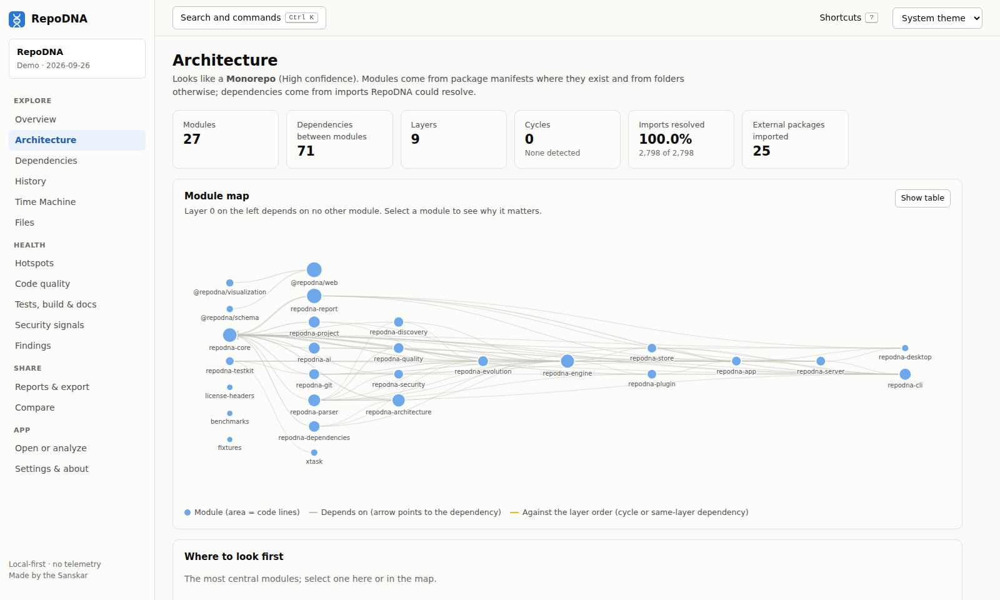

# Architecture analysis

RepoDNA infers a repository's architecture from its layout, its package manifests, and the
imports in its source files: which modules exist, how they depend on each other, which
layers they form, and where the structure is tangled.

```sh
repodna architecture
repodna architecture --format json | jq '.modules[] | {name, files, fanIn, fanOut}'
```



Everything here is static and lexical. Imports computed at run time, dependency injection,
reflection, configuration-driven loading, and generated code are invisible, and reports say
so in their method notes.

## Modules

Package manifests (a Rust crate, an npm package, a Go module, a Maven module, ...) declare
module boundaries directly. Everything else is grouped by directory, following common
layout conventions:

- Single-child directory chains are collapsed, so `src/main/java/com/example/app` counts as
  one step and deep namespace directories do not hide the real components.
- Conventional source roots (`src`, `lib`, `app`, ...) are looked into, so `src/parser` and
  `src/codegen` become separate modules instead of one `src` module.
- Grouping directories (`packages`, `apps`, `crates`, `cmd`, `internal`, ...) contribute one
  module per child directory.
- A module that holds at least half of all code files (and at least ten files) is split
  into its subdirectories, at most twice, so one giant module cannot hide the structure.

Each module records its files, code lines, main language, fan-in and fan-out, instability,
centrality, layer, entry points, the external packages it uses, and why it matters.

## Import resolution

Imports extracted by the language analyzers are resolved to repository files or to
external packages. Resolution understands relative paths, module systems (Rust crates and
modules, Python packages, Go modules, JVM packages, C# namespaces, PHP namespaces),
workspace package names, and common aliases such as `@/`. TypeScript type-only imports are
ignored, because the compiler erases them. The share of imports that could not be resolved
is reported; when it is high, the dependency graph is incomplete, and the
`architecture.unresolved` finding says so.

## Graphs and what is derived from them

| Result | How it is computed |
|---|---|
| File and module dependency edges | Resolved imports; module edges are weighted by the number of imports. |
| Layers | Modules that depend on nothing are layer 0; every other module is one layer above its highest dependency. Modules in a cycle share a layer. |
| Cycles | Strongly connected components of the module graph and of the file graph. |
| Fan-in, fan-out, instability | Incoming and outgoing edges; instability is fan-out ÷ (fan-in + fan-out). |
| Centrality | Betweenness centrality: how many shortest dependency paths between other modules pass through a module. |
| Entry points | Files that start execution or define a package's public surface, such as `main` functions, `if __name__ == "__main__"` guards, `bin` targets, and package entry modules. |

## Architecture style

The inferred style is a label with a confidence and the signals behind it. Signals are
checked in this order, and the first that applies names the style; all of them are listed
as evidence:

| Style | Signal |
|---|---|
| Monorepo | Two or more packages, or a workspace declaration. |
| Layered | Three or more modules in three or more layers, without module cycles. |
| Modular | At least four modules with dependencies, an average fan-out of three or less, and no module holding half of the code. |
| Monolithic | One module holds 60% or more of the first-party code. |
| Flat | Few modules and few files. |
| Mixed | None of the signals above applies. |

## Architecture over time

With the `deep` profile, RepoDNA reconstructs modules and module dependencies at every Time
Machine snapshot by reading the files at that revision, so you can see how the structure
evolved. See [the Time Machine](time-machine.md).

## Findings

`architecture.cycle`, `architecture.file-cycle`, `architecture.concentration`,
`architecture.centrality`, `architecture.isolated-module`, and `architecture.unresolved`;
see [the rules reference](repository-dna.md#rules).
