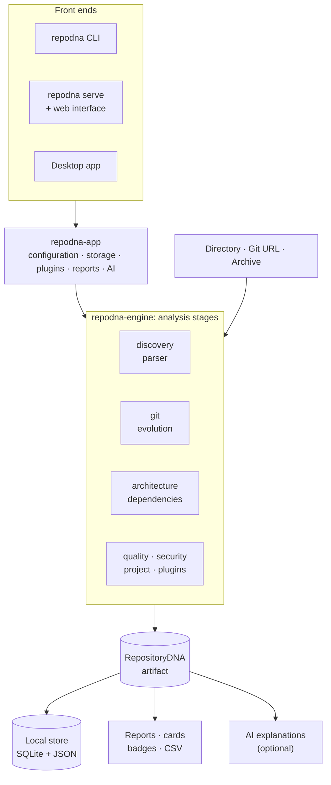

# Architecture

RepoDNA is a Rust workspace with a web interface in TypeScript. One idea holds it together:
**the analysis produces a versioned artifact, and everything else reads the artifact.**

## Layers

**The model** (`repodna-core`) defines the RepositoryDNA artifact, findings, evidence,
confidence, severity, configuration, and safe artifact I/O. It contains no analysis logic,
so it stays stable and easy to serialize. The JSON Schemas are generated from these types.

**Analyzers** are independent crates that read files or history and produce model types:

| Crate | Responsibility |
|---|---|
| `repodna-discovery` | Walk the tree (respecting ignore rules), classify files, read them safely, extract archives safely |
| `repodna-parser` | Language registry and lexical analysis: lines, comments, imports, symbols, complexity |
| `repodna-git` | Hardened Git runner, history, refs, trees, and URL safety |
| `repodna-dependencies` | Manifests and lockfiles, one provider per ecosystem |
| `repodna-architecture` | Modules, import resolution, graphs, cycles, layers, centrality |
| `repodna-quality` | Complexity, size, duplication, similarity, markers, dead code, hotspots |
| `repodna-security` | Secret candidates, risky patterns, permissions |
| `repodna-project` | Tests, build systems, commands, CI, documentation, opt-in execution |
| `repodna-evolution` | Epochs, events, Time Machine snapshots, the project story |

**The engine** (`repodna-engine`) prepares the input (cloning or extracting into a
temporary directory), runs the stages enabled by the profile, records each stage's status
and duration, derives insights, findings, and the fingerprint, and assembles the artifact.
A stage that cannot run is recorded as unavailable instead of failing the analysis.

**Services** used by every front end live in `repodna-app`: locating configuration,
storage, and plugins; assembling the effective configuration; running analyses with the
cache, plugins, and storage; loading earlier analyses; writing reports without overwriting
files RepoDNA did not create; and AI explanations. Front ends only parse input and present
results, so the CLI, the server, and the desktop app behave the same way.

**Outputs** read the artifact alone:

| Crate | Output |
|---|---|
| `repodna-store` | SQLite index, stored artifacts, and the per-file cache |
| `repodna-report` | Markdown, HTML, DNA cards (SVG and PNG), badges, CSV, CI summaries, onboarding guides, comparisons |
| `repodna-ai` | Evidence-grounded explanations through optional providers |
| `repodna-plugin` | Plugin discovery, declarative languages, and the analyzer protocol |

**Front ends**: `repodna-cli` (the `repodna` binary), `repodna-server` (the token-protected
local API and web interface behind `repodna serve`), and the Tauri desktop app in
`apps/desktop`, which calls the same services through native commands instead of HTTP.

**The web interface** (`apps/web`) is a React application with hash routing. It reads
artifacts through one `Backend` interface with three implementations: the local server,
the desktop app, or none (static hosting, where it opens files and the bundled demo).
`packages/schema` provides TypeScript types generated from the artifact schema, and
`packages/visualization` the layout and color helpers for its charts.

## Design principles

- **Evidence first.** Every conclusion carries the files, lines, commits, or measurements
  behind it, the method, and its limitations. Confidence and severity are separate: how sure
  RepoDNA is, and how much it matters.
- **Honest about depth.** Analysis is lexical, not compiler-level, and every language is
  labeled with the depth of analysis behind it. Missing data is reported as missing, never
  as zero.
- **Local-first and private.** No telemetry and no network use except for what you ask
  (cloning a URL, an AI provider you configured). Secret values are never stored.
- **Safe with untrusted repositories.** Read-only analysis, a hardened Git runner, safe
  archive extraction, no command execution by default, and linear-time regular expressions.
  A repository's configuration cannot enable plugins, AI, or execution.
- **Deterministic.** The same revision and configuration produce the same results; windows
  are measured from the latest commit; `--reproducible` and `SOURCE_DATE_EPOCH` make
  artifacts byte-identical.
- **Degrade gracefully.** Without Git, without history, or with unparseable files, the rest
  of the analysis still runs, and the gaps are explained.
- **The artifact is the contract.** Reports, the web interface, comparisons, and AI all read
  the artifact, so any of them can be regenerated later, elsewhere, and without the
  repository. The schema is versioned and readers ignore unknown fields.

## Data flow of one analysis

1. The front end builds the effective configuration (defaults, user configuration, the
   repository's `repodna.toml` with untrusted settings removed, `--config`, and flags).
2. The engine prepares the input and walks it once. Files are read and parsed in parallel,
   reusing cached results for unchanged files.
3. History is streamed from `git log` in one pass; branches, tags, and trees are read with a
   few more Git commands.
4. The remaining stages run on the collected data; the evolution stage reads historical
   trees and blobs for Time Machine snapshots.
5. Enabled plugins receive a summary of the analysis and add findings and metrics.
6. Insights, findings, suppressions, and the fingerprint are computed, and the artifact is
   stored (atomically) unless `--no-store` was given.
7. The front end presents the result; reports and views are generated from the artifact.

More detail: [the analysis engine](analysis-engine.md), [the RepositoryDNA
model](repository-dna.md), and [development](development.md).
