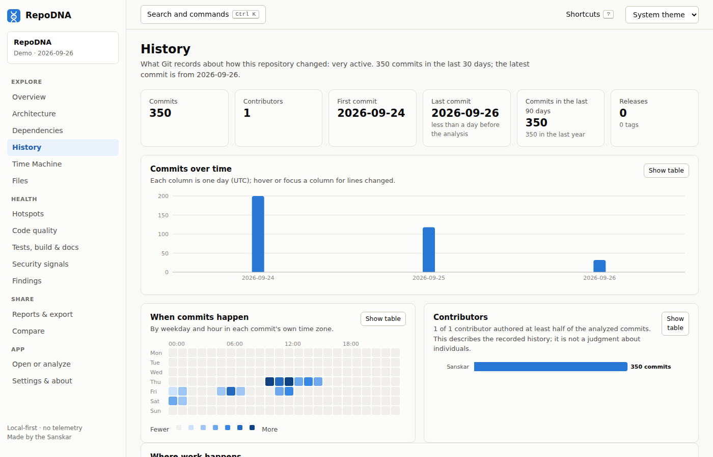

# Git history and code archaeology

When the input is a Git repository, RepoDNA reads its history to answer questions that the
files alone cannot: how the project grew, who worked on what, what changes most, and how
active it is now.

```sh
repodna history
repodna hotspots
repodna show --section history,contributors
```



## How history is read

RepoDNA runs the `git` executable, read-only, through a [hardened
runner](security.md#how-repodna-protects-you): it streams `git log` with raw changes and
line counts in one pass, and reads branches, tags, and remotes separately. It does not
link a Git library, so it supports every repository format your Git supports. Without Git,
the history sections are marked *unavailable* and the rest of the analysis still runs.

- **Which commits**: those reachable from `HEAD`, newest first, up to `analysis.max_commits`
  (50,000 by default; `--max-commits` for one run). If the limit is reached,
  `git.historyTruncated` is set and reports say so.
- **Shallow clones** (for example CI checkouts with `fetch-depth: 1`) are detected and
  flagged with `git.shallow`; history-based results then describe only the fetched
  commits. For a full picture, analyze a full clone.
- **Merge commits** are counted but carry no file changes of their own.
- **Renames** are followed, so a file's history continues across moves.
- **Identities** are grouped by e-mail address after applying the repository's `.mailmap`.
- **The artifact stores** up to `analysis.artifact_commits` (1,000) commits with hash,
  date, author, and subject; statistics use every analyzed commit.

Everything that should not depend on when you run the analysis (recent churn, "recent"
windows) is measured backwards from the **latest commit**, so the same revision always
gives the same numbers. Only the activity level, which answers "is it active now?", is
measured against the analysis time, and the artifact records that time.

## What it reports

| Result | Meaning |
|---|---|
| Timeline | Commits, authors, and lines added and removed per month, and commits per day. Histories shorter than three months are charted per day; reports chart long histories per quarter or year. |
| Contributors | Per identity: commits, lines added and removed, first and last commit, active days, and main areas. |
| Ownership | Share of commits by the top contributor, and how many contributors authored half of all commits. |
| Activity level | `very-active` (at least 30 commits in the last 30 days), `active` (at least 5), `moderate` (at least one in 90 days), `low` (at least one in 365 days), or `dormant`. |
| Releases | Tags that look like versions (`v1.2.3`, `2.0`, `v1.0.0-rc.1`), with their dates and the commits between them. |
| Dormant periods | Gaps without commits of at least `dormant_days` (90). |
| File history | Per file: commits, authors, lines added and removed, when it first appeared and last changed, and earlier paths. |
| Hotspots | Files that change often and are complex; see below. |
| Recent changes | What changed in the `recent_days` (90) before the latest commit: commits, files, directories, and dependency changes. |

## Hotspots

A hotspot is a file where change and complexity meet: code that is modified often and is
hard to modify safely. Files changed in at least `hotspot_min_commits` (3) commits are
ranked by a weighted sum of percentile ranks:

| Signal | Weight |
|---|---|
| Commits touching the file | 30% |
| Churn (lines added and removed) | 20% |
| Commits in the recent window | 15% |
| Highest function complexity | 15% |
| Code lines | 10% |
| Distinct authors | 5% |
| Files that import it | 5% |

Each hotspot lists the signals that put it there, such as "Changed in 42 commits" or
"Contains a function with complexity 31". See also [complexity](complexity.md).

## People

History describes how a repository was worked on, not the quality of anyone's work.
RepoDNA reports identities and their commits, never judgments about people. Squash merges,
pair programming, bots, and people using several e-mail addresses all distort attribution.

- `--anonymize` (or `privacy.anonymize_contributors`) replaces names with "Contributor 1",
  "Contributor 2", and so on in the artifact.
- `--no-commit-messages` (or `privacy.include_commit_messages = false`) keeps commit
  subjects out of the artifact.
- `--privacy public` replaces names with pseudonyms in reports and exports.

See [privacy](privacy.md).

## Findings

`activity.hotspot`, `activity.high-churn-area`, `contributors.concentration`,
`evolution.dormant-period`, `evolution.abandoned-area`, and `evolution.new-module`; see
[the rules reference](repository-dna.md#rules). For how the repository changed over time,
see [the Time Machine](time-machine.md).
