# Screenshots

Screenshots of the RepoDNA web interface in every release. Each one shows that release's
own analysis of this repository at its tag, so the numbers, views, and layout are the
ones a user of that version saw. The [README](../../README.md#screenshots) and the guides
show those of the latest release.

| Version | Released | Folder | Release notes |
|---|---|---|---|
| [1.2.0](#120) | 2026-10-05 | [`v1.2.0`](v1.2.0) | [RepoDNA 1.2.0](../releases/v1.2.0/README.md) |
| [1.1.1](#111) | 2026-10-05 | [`v1.1.1`](v1.1.1) | [RepoDNA 1.1.1](../releases/v1.1.1/README.md) |
| [1.1.0](#110) | 2026-10-04 | [`v1.1.0`](v1.1.0) | [RepoDNA 1.1.0](../releases/v1.1.0/README.md) |
| [1.0.0](#100) | 2026-09-27 | [`v1.0.0`](v1.0.0) | [RepoDNA 1.0.0](../releases/v1.0.0/README.md) |

## How the interface changed

The same views in each version, oldest on the left.

| | 1.0.0 | 1.1.0 | 1.1.1 | 1.2.0 |
|---|---|---|---|---|
| **Overview** |  |  | <a href="v1.1.1/desktop/overview-light.png">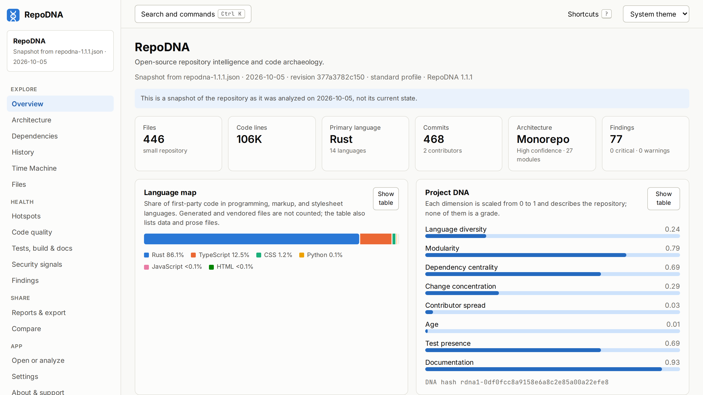</a> | <a href="v1.2.0/desktop/overview-light.png">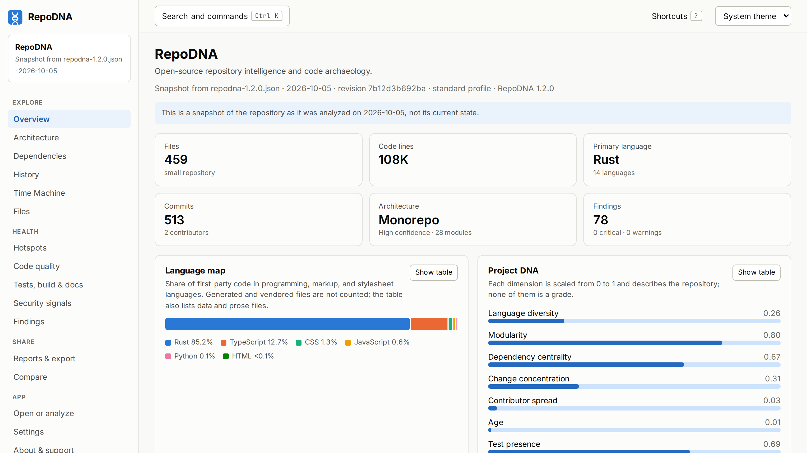</a> |
| **Architecture** | <a href="v1.0.0/desktop/architecture-dark.png">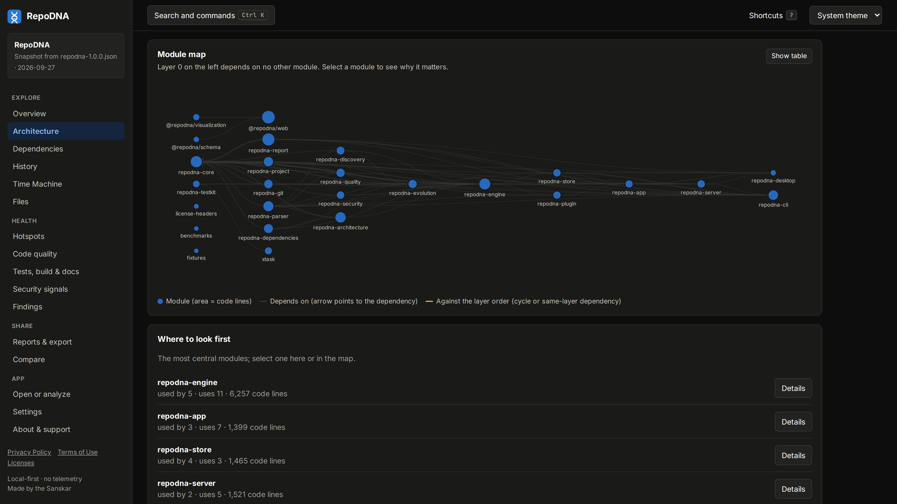</a> | <a href="v1.1.0/desktop/architecture-dark.png">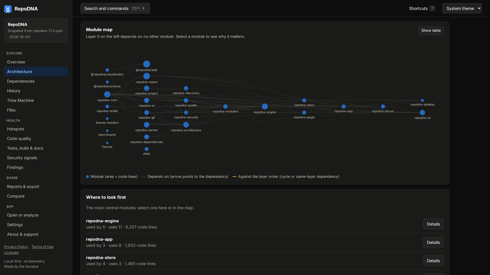</a> |  | <a href="v1.2.0/desktop/architecture-dark.png">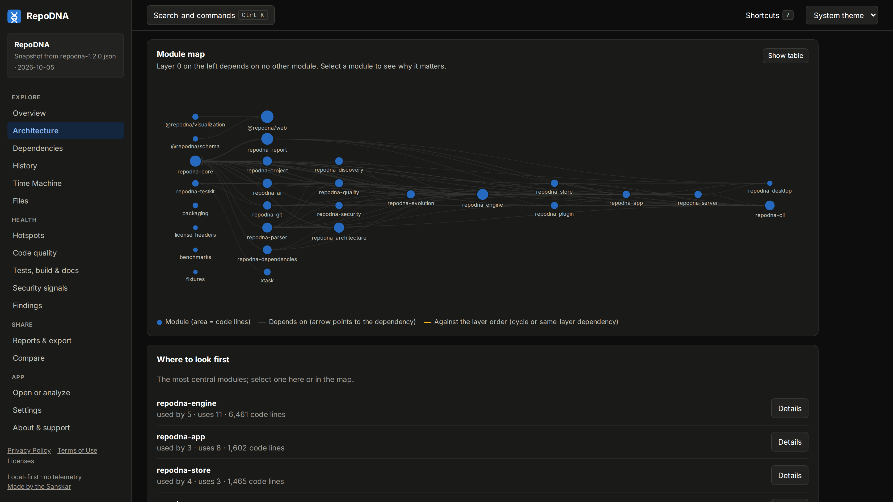</a> |
| **History** | <a href="v1.0.0/desktop/history-light.png">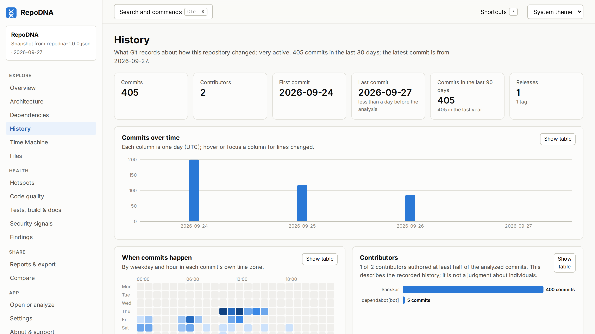</a> | <a href="v1.1.0/desktop/history-light.png">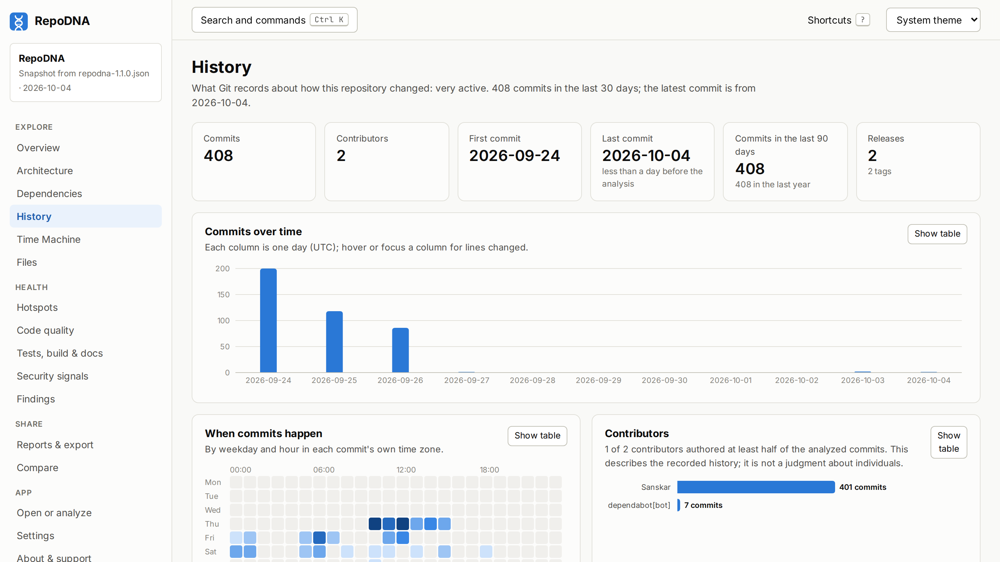</a> | <a href="v1.1.1/desktop/history-light.png">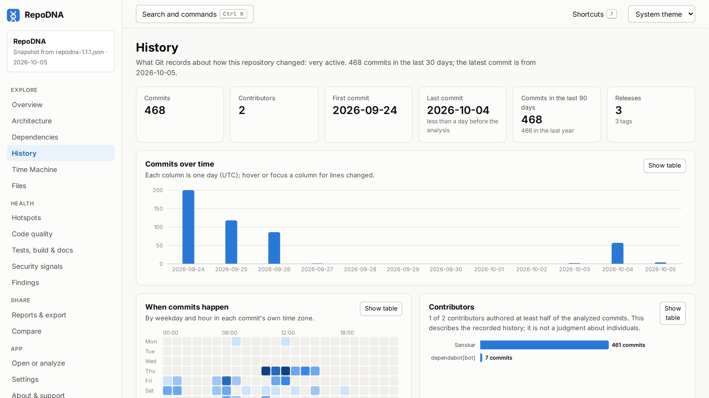</a> | <a href="v1.2.0/desktop/history-light.png">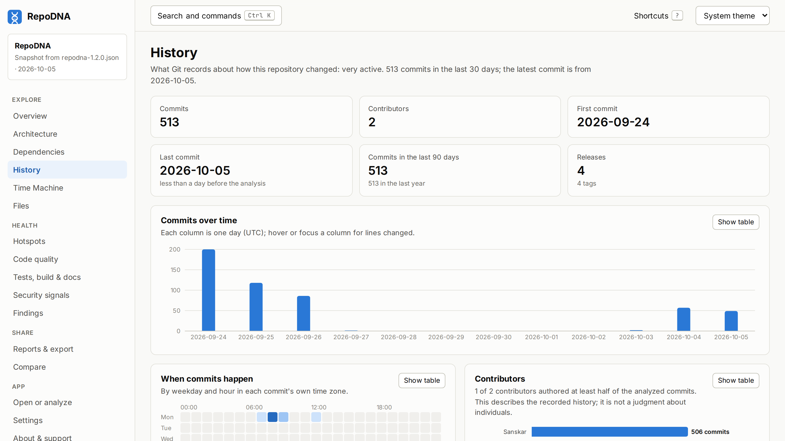</a> |
| **Hotspots** | <a href="v1.0.0/desktop/hotspots-dark.png">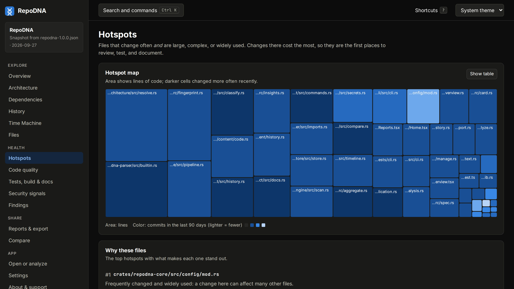</a> | <a href="v1.1.0/desktop/hotspots-dark.png">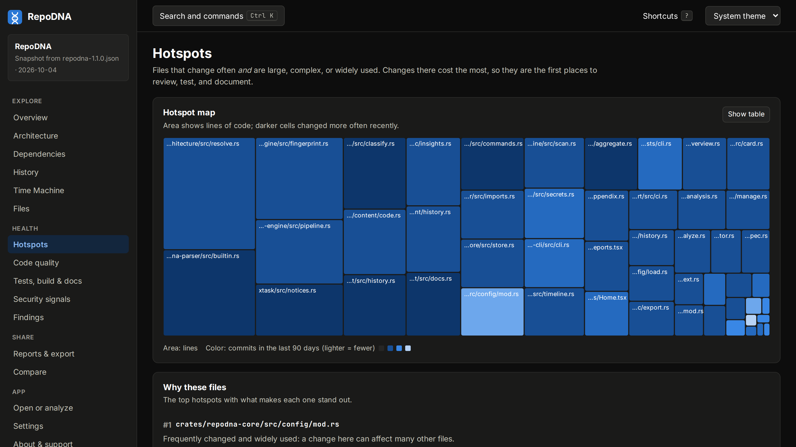</a> | <a href="v1.1.1/desktop/hotspots-dark.png">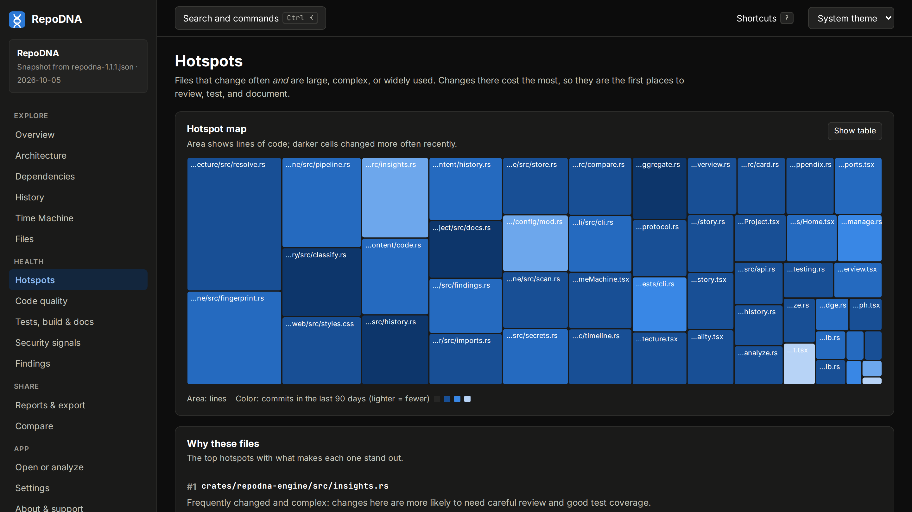</a> |  |
| **Phone: overview** | <a href="v1.0.0/phone/overview-light.png">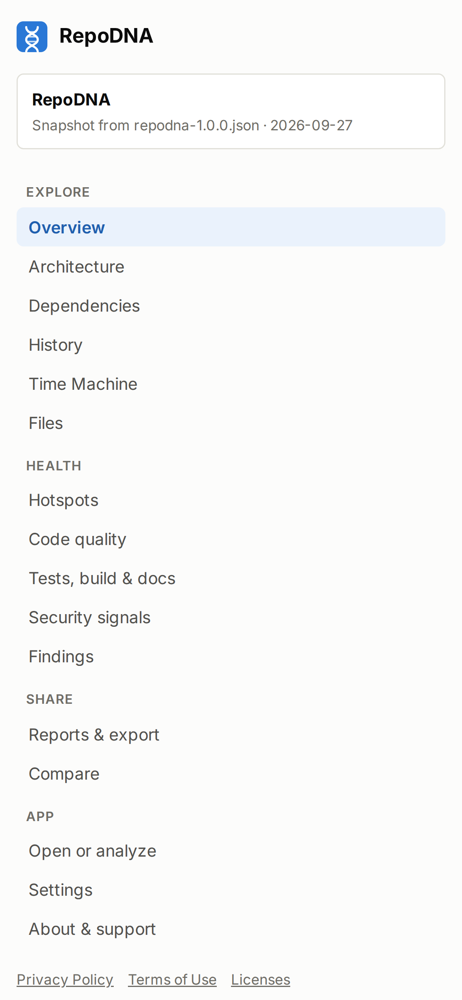</a> |  |  |  |
| **Phone: history** | <a href="v1.0.0/phone/history-light.png">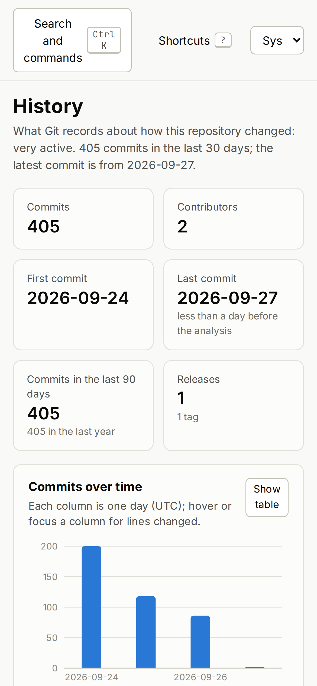</a> | <a href="v1.1.0/phone/history-light.png">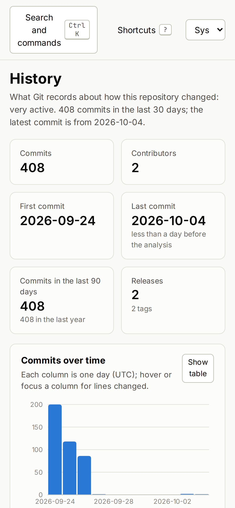</a> | <a href="v1.1.1/phone/history-light.png">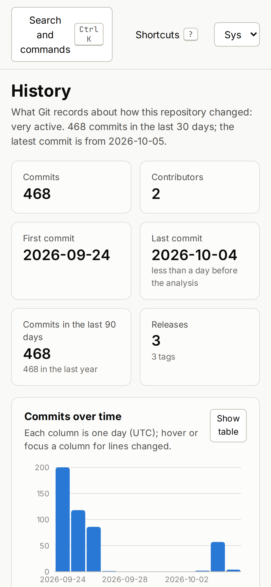</a> |  |

Before 1.2.0, a phone showed the whole navigation before the view, as the phone overview
of those versions shows; the phone screenshots of their history and hotspots are
scrolled down to the view. 1.2.0 folds the navigation behind a Menu button.

## 1.2.0

Released on 2026-10-05. [Release notes](../releases/v1.2.0/README.md) · folder [`v1.2.0`](v1.2.0).

**Desktop** (2880 × 1620; the architecture view 3360 × 1890): [Overview, light](v1.2.0/desktop/overview-light.png) · [Overview, dark](v1.2.0/desktop/overview-dark.png) · [Architecture, dark](v1.2.0/desktop/architecture-dark.png) · [History, light](v1.2.0/desktop/history-light.png) · [History, dark](v1.2.0/desktop/history-dark.png) · [Time Machine, light](v1.2.0/desktop/time-machine-light.png) · [Hotspots, dark](v1.2.0/desktop/hotspots-dark.png) · [Findings, dark](v1.2.0/desktop/findings-dark.png) · [Files, light](v1.2.0/desktop/files-light.png) · [Code quality, light](v1.2.0/desktop/quality-light.png) · [Tests, build & docs, light](v1.2.0/desktop/project-light.png) · [Search, dark](v1.2.0/desktop/search-dark.png).

**Phone** (1170 × 2532): [Overview, light](v1.2.0/phone/overview-light.png) · [Overview, dark](v1.2.0/phone/overview-dark.png) · [Menu, light](v1.2.0/phone/menu-light.png) · [Menu, dark](v1.2.0/phone/menu-dark.png) · [History, light](v1.2.0/phone/history-light.png) · [History, dark](v1.2.0/phone/history-dark.png) · [Hotspots, light](v1.2.0/phone/hotspots-light.png) · [Hotspots, dark](v1.2.0/phone/hotspots-dark.png).

## 1.1.1

Released on 2026-10-05. [Release notes](../releases/v1.1.1/README.md) · folder [`v1.1.1`](v1.1.1).

**Desktop** (2880 × 1620; the architecture view 3360 × 1890): [Overview, light](v1.1.1/desktop/overview-light.png) · [Overview, dark](v1.1.1/desktop/overview-dark.png) · [Architecture, dark](v1.1.1/desktop/architecture-dark.png) · [History, light](v1.1.1/desktop/history-light.png) · [History, dark](v1.1.1/desktop/history-dark.png) · [Time Machine, light](v1.1.1/desktop/time-machine-light.png) · [Hotspots, dark](v1.1.1/desktop/hotspots-dark.png) · [Findings, dark](v1.1.1/desktop/findings-dark.png) · [Files, light](v1.1.1/desktop/files-light.png) · [Code quality, light](v1.1.1/desktop/quality-light.png) · [Tests, build & docs, light](v1.1.1/desktop/project-light.png) · [Search, dark](v1.1.1/desktop/search-dark.png).

**Phone** (1170 × 2532): [Overview, light](v1.1.1/phone/overview-light.png) · [Overview, dark](v1.1.1/phone/overview-dark.png) · [History, light](v1.1.1/phone/history-light.png) · [History, dark](v1.1.1/phone/history-dark.png) · [Hotspots, light](v1.1.1/phone/hotspots-light.png) · [Hotspots, dark](v1.1.1/phone/hotspots-dark.png).

## 1.1.0

Released on 2026-10-04. [Release notes](../releases/v1.1.0/README.md) · folder [`v1.1.0`](v1.1.0).

**Desktop** (2880 × 1620; the architecture view 3360 × 1890): [Overview, light](v1.1.0/desktop/overview-light.png) · [Overview, dark](v1.1.0/desktop/overview-dark.png) · [Architecture, dark](v1.1.0/desktop/architecture-dark.png) · [History, light](v1.1.0/desktop/history-light.png) · [History, dark](v1.1.0/desktop/history-dark.png) · [Time Machine, light](v1.1.0/desktop/time-machine-light.png) · [Hotspots, dark](v1.1.0/desktop/hotspots-dark.png) · [Findings, dark](v1.1.0/desktop/findings-dark.png) · [Files, light](v1.1.0/desktop/files-light.png) · [Code quality, light](v1.1.0/desktop/quality-light.png) · [Tests, build & docs, light](v1.1.0/desktop/project-light.png) · [Search, dark](v1.1.0/desktop/search-dark.png).

**Phone** (1170 × 2532): [Overview, light](v1.1.0/phone/overview-light.png) · [Overview, dark](v1.1.0/phone/overview-dark.png) · [History, light](v1.1.0/phone/history-light.png) · [History, dark](v1.1.0/phone/history-dark.png) · [Hotspots, light](v1.1.0/phone/hotspots-light.png) · [Hotspots, dark](v1.1.0/phone/hotspots-dark.png).

## 1.0.0

Released on 2026-09-27. [Release notes](../releases/v1.0.0/README.md) · folder [`v1.0.0`](v1.0.0).

**Desktop** (2880 × 1620; the architecture view 3360 × 1890): [Overview, light](v1.0.0/desktop/overview-light.png) · [Overview, dark](v1.0.0/desktop/overview-dark.png) · [Architecture, dark](v1.0.0/desktop/architecture-dark.png) · [History, light](v1.0.0/desktop/history-light.png) · [History, dark](v1.0.0/desktop/history-dark.png) · [Time Machine, light](v1.0.0/desktop/time-machine-light.png) · [Hotspots, dark](v1.0.0/desktop/hotspots-dark.png) · [Findings, dark](v1.0.0/desktop/findings-dark.png) · [Files, light](v1.0.0/desktop/files-light.png) · [Code quality, light](v1.0.0/desktop/quality-light.png) · [Tests, build & docs, light](v1.0.0/desktop/project-light.png) · [Search, dark](v1.0.0/desktop/search-dark.png).

**Phone** (1170 × 2532): [Overview, light](v1.0.0/phone/overview-light.png) · [Overview, dark](v1.0.0/phone/overview-dark.png) · [History, light](v1.0.0/phone/history-light.png) · [History, dark](v1.0.0/phone/history-dark.png) · [Hotspots, light](v1.0.0/phone/hotspots-light.png) · [Hotspots, dark](v1.0.0/phone/hotspots-dark.png).

## How they were made

- **The interface** of each version was built from the code at its tag.
- **The analysis** was made by the command line of the same version. For 1.0.0, 1.1.0,
  and 1.1.1, that is the Linux build downloaded from the GitHub release and checked
  against its `SHA256SUMS.txt`. It analyzed a checkout of this repository at the tag,
  with only the branches and tags that existed then, and with `--reproducible` and
  `SOURCE_DATE_EPOCH` set to the moment the release was published. The 1.2.0 analysis
  was made on the day of that release.
- **The screenshots** were taken in Chromium: desktop views in a 1440 × 810 window at twice
  the resolution (the module map in a 1680 × 945 window, so that every module fits), and
  phone views on a 390 × 844 screen at three times the resolution. They were rendered
  with the Inter and JetBrains Mono fonts; the interface itself uses the system font of
  the computer it runs on.

Screenshots of a new release go in a folder named after its tag, such as `v1.3.0`, with
the same views, and a column and a section on this page.
