# Media kit

Images of RepoDNA 1.2.0 for posts, articles, and talks: promo images, Project DNA cards,
and screenshots of the web interface on a desktop and a phone, in light and dark. Every
screenshot shows RepoDNA's analysis of its own repository at the `v1.2.0` tag (513
commits, 459 files). Like the rest of this repository, the images are licensed under the
[Apache License 2.0](../../LICENSE).

- [Promo images](#promo-images)
- [Project DNA cards](#project-dna-cards)
- [Desktop screenshots](#desktop-screenshots)
- [Phone screenshots](#phone-screenshots)
- [How they were made](#how-they-were-made)

## Promo images

| Image | Size | Fits |
|---|---|---|
| [`promo/launch-16x9.png`](promo/launch-16x9.png) | 3200 × 1800 (16:9) | X, LinkedIn, Facebook, and slides |
| [`promo/whats-new-1x1.png`](promo/whats-new-1x1.png) | 2160 × 2160 (1:1) | Instagram and LinkedIn posts |
| [`promo/phones-4x5.png`](promo/phones-4x5.png) | 2160 × 2700 (4:5) | Instagram portrait posts |

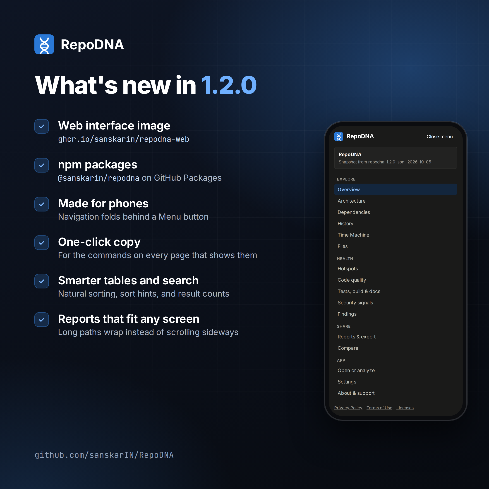 

## Project DNA cards

The cards that `repodna card --format png` makes for RepoDNA itself, at the size link
previews use: 2400 × 1260, about 1.91:1.

| Image | Theme |
|---|---|
| [`cards/dna-card-light.png`](cards/dna-card-light.png) | Light |
| [`cards/dna-card-dark.png`](cards/dna-card-dark.png) | Dark |

 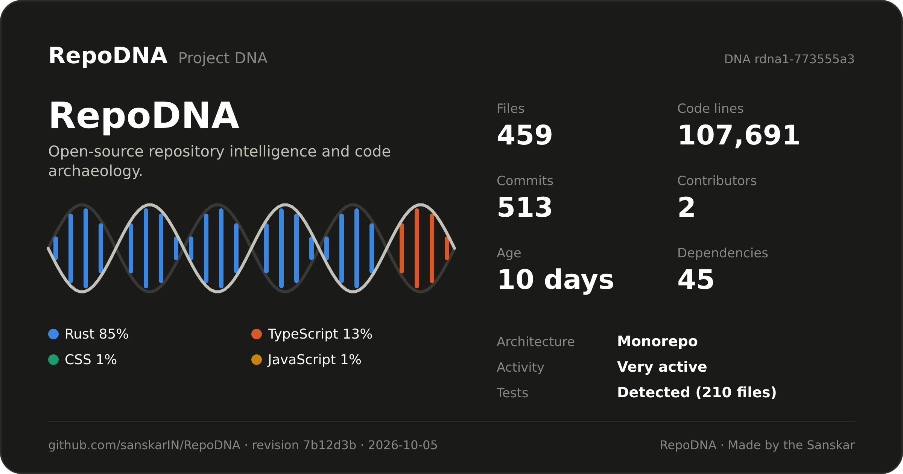

## Desktop screenshots

2880 × 1620 (16:9), taken in a 1440 × 810 window at twice the resolution. The module map
of the architecture view is 3360 × 1890, from a 1680 × 945 window, so that every module
fits.

| | |
|---|---|
|  | 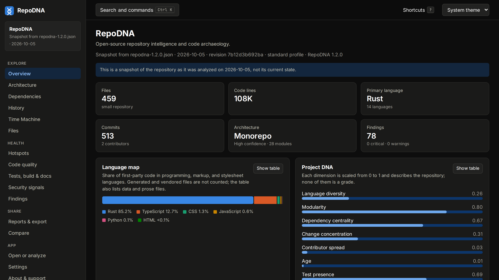 |
| `desktop/overview-light.png` | `desktop/overview-dark.png` |
|  |  |
| `desktop/architecture-dark.png` | `desktop/history-light.png` |
| 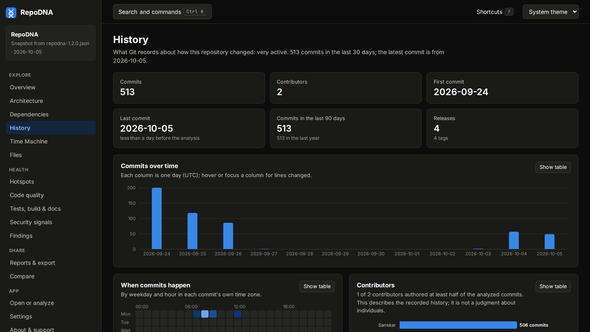 | 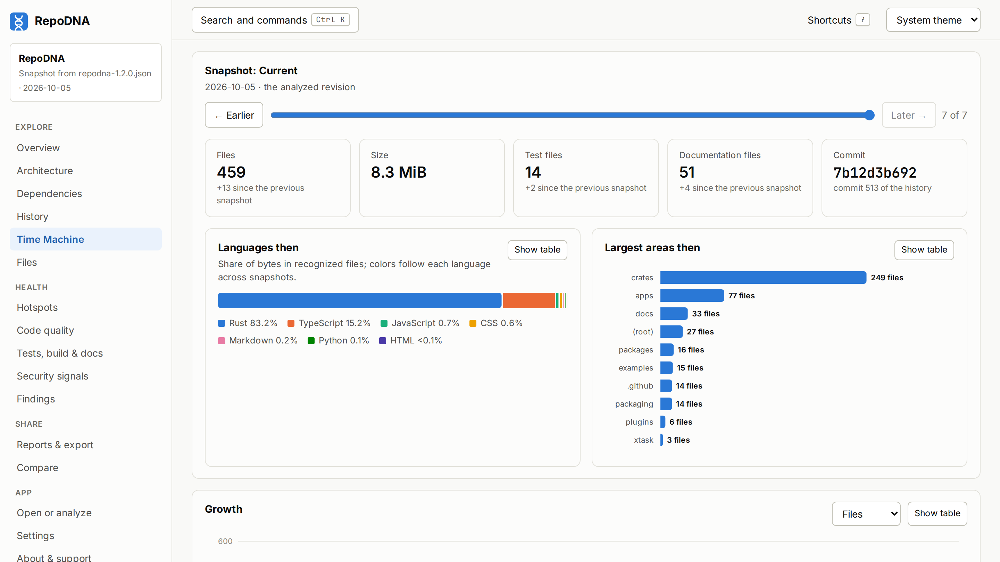 |
| `desktop/history-dark.png` | `desktop/time-machine-light.png` |
| 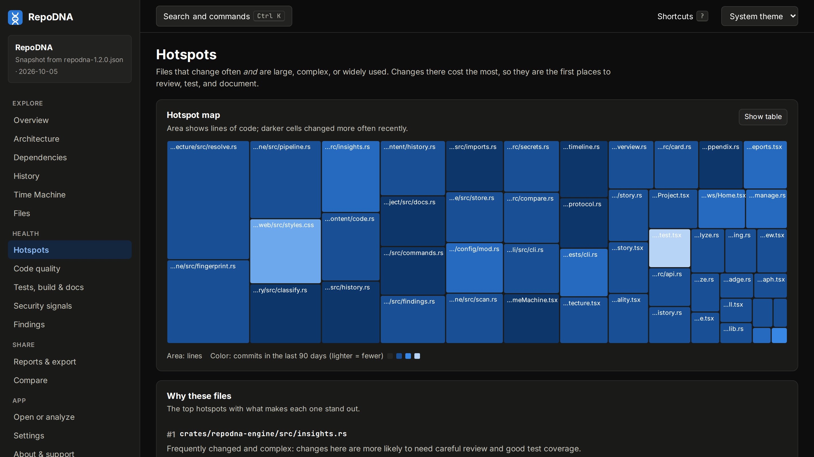 | 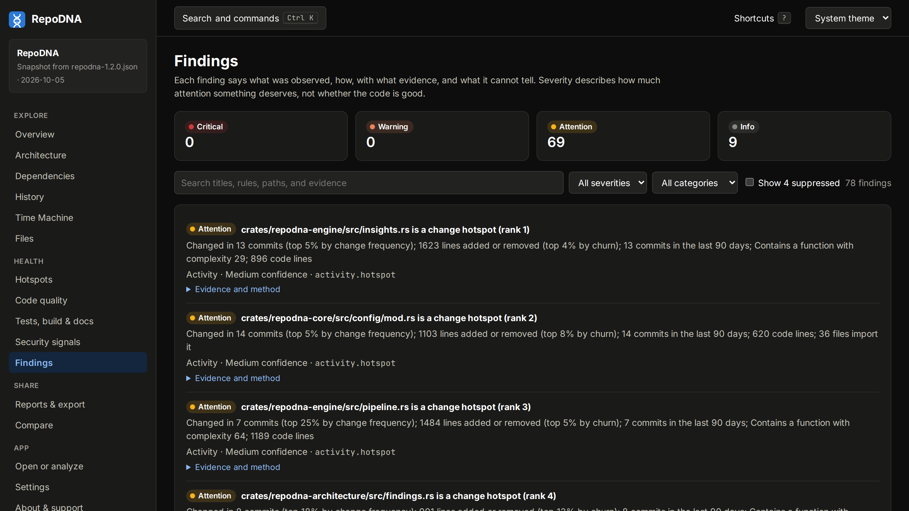 |
| `desktop/hotspots-dark.png` | `desktop/findings-dark.png` |
| 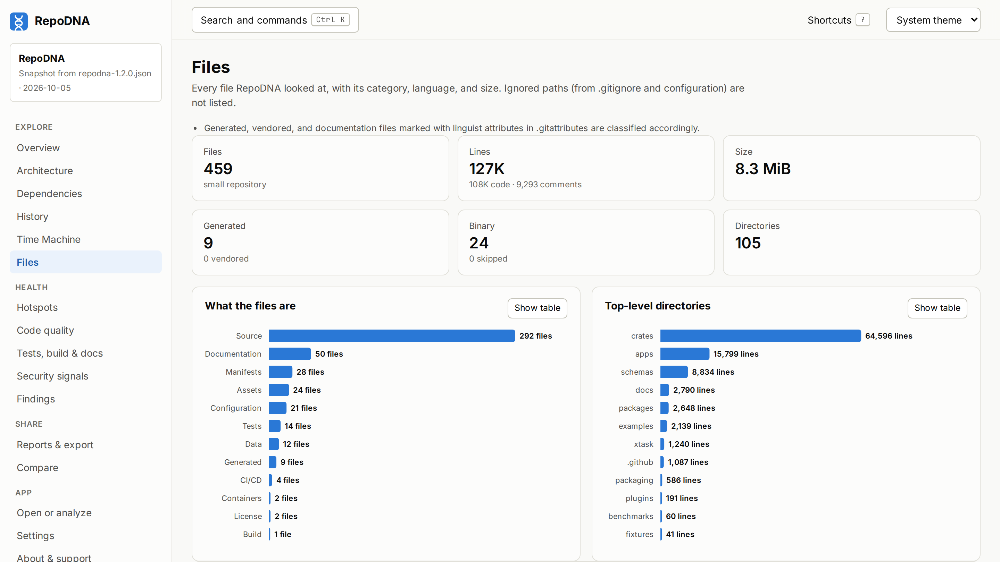 | 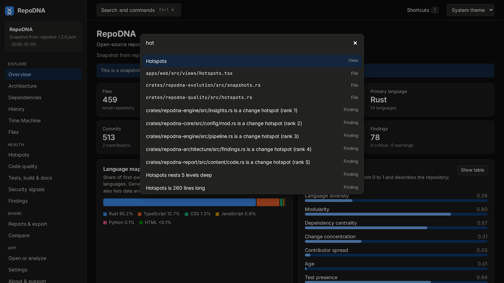 |
| `desktop/files-light.png` | `desktop/search-dark.png` |

## Phone screenshots

1170 × 2532, taken on a 390 × 844 screen at three times the resolution, for stories and
portrait posts.

| | | | |
|---|---|---|---|
| 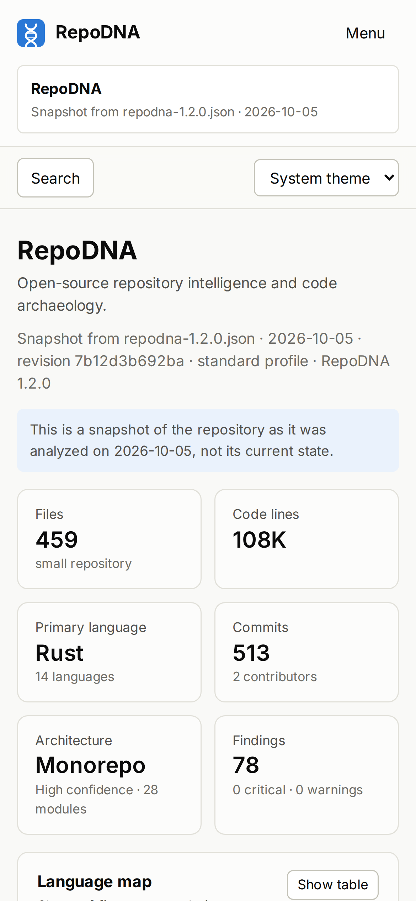 | 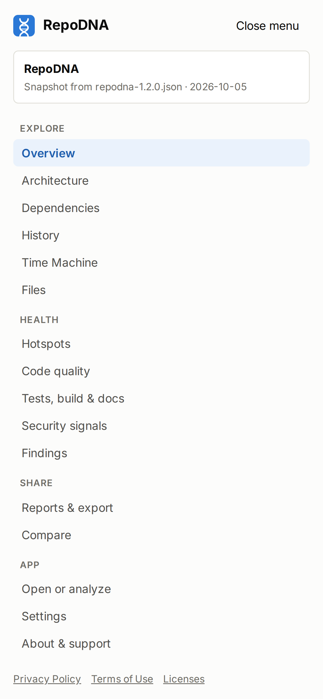 | 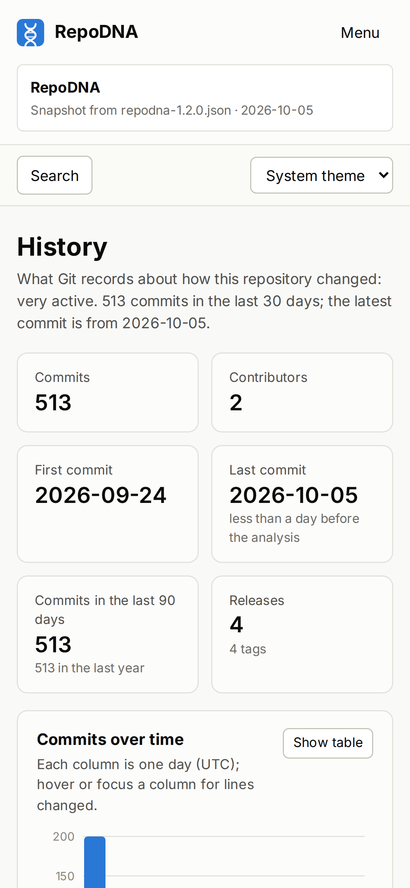 | 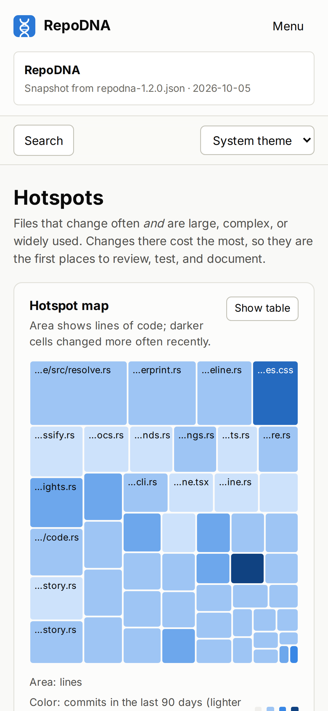 |
| `phone/overview-light.png` | `phone/menu-light.png` | `phone/history-light.png` | `phone/hotspots-light.png` |
| 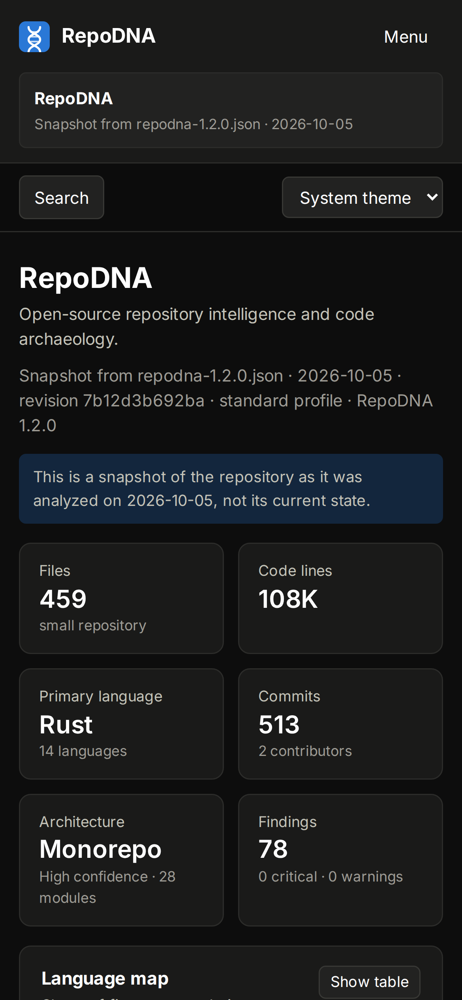 | 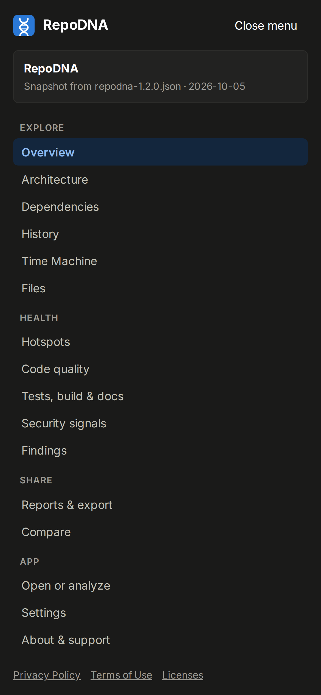 | 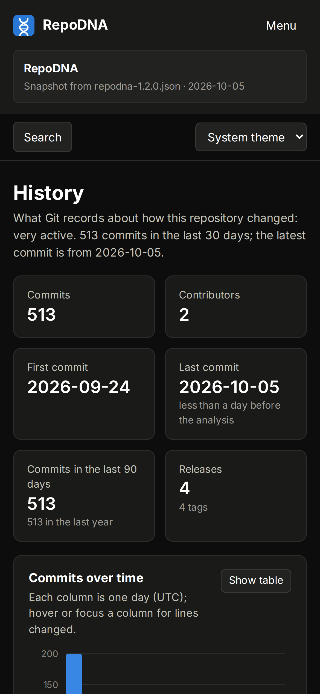 | 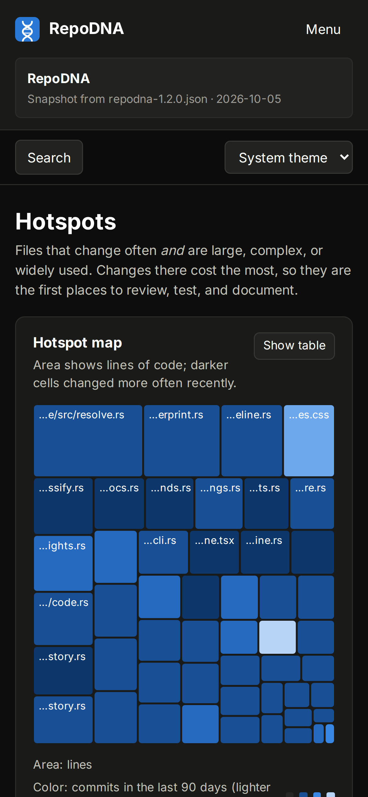 |
| `phone/overview-dark.png` | `phone/menu-dark.png` | `phone/history-dark.png` | `phone/hotspots-dark.png` |

## How they were made

The screenshots show the web interface of RepoDNA 1.2.0 in Chromium, with an analysis of
this repository at the `v1.2.0` tag made by `repodna analyze --format json`. They were
rendered with the Inter and JetBrains Mono fonts; the interface itself uses the system
font of the computer it runs on. The promo images frame those screenshots, and the cards
come from `repodna card --format png`, with `--dark` for the dark one.

To make images of your own repository, run `repodna card --format png` for its
[Project DNA card](../dna-cards.md), and open its analysis in the
[web version](https://sanskarin.github.io/RepoDNA/) or with `repodna serve` to take
screenshots.
