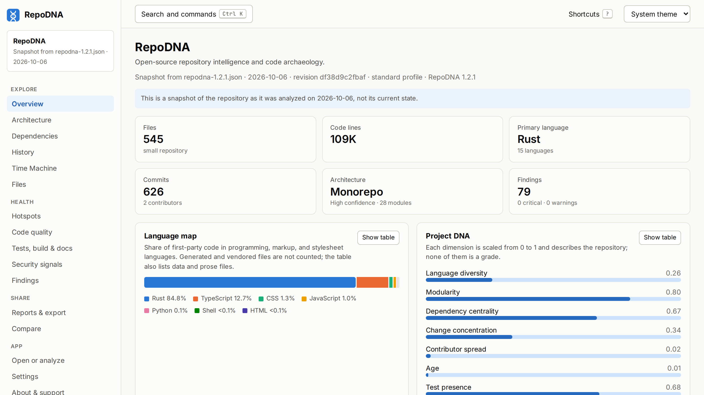
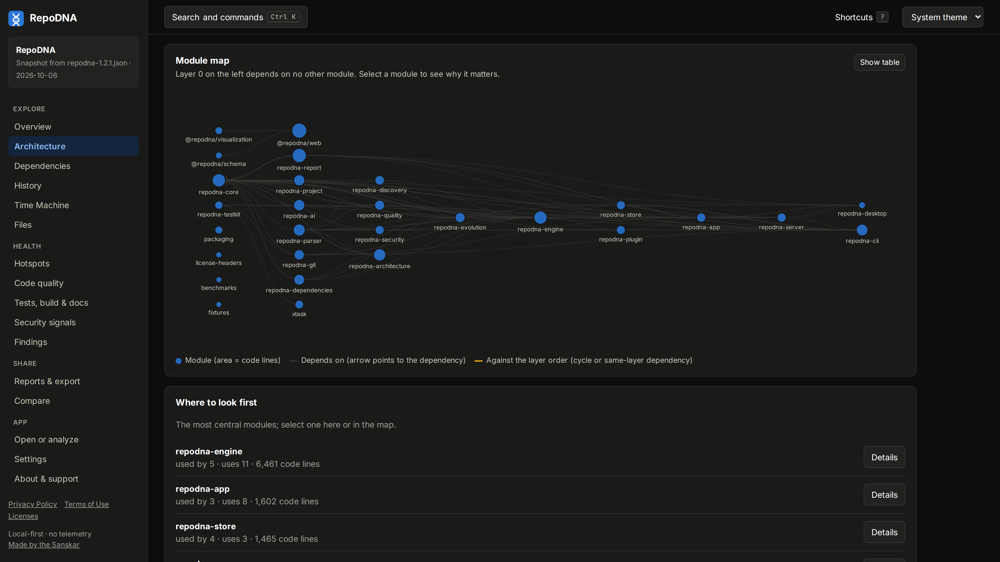

# RepoDNA 1.2.1

Released on 2026-10-06: [GitHub release](https://github.com/sanskarIN/RepoDNA/releases/tag/v1.2.1) · [changes since 1.2.0](https://github.com/sanskarIN/RepoDNA/compare/v1.2.0...v1.2.1) · [source code at v1.2.1](https://github.com/sanskarIN/RepoDNA/tree/v1.2.1).

The npm packages on npmjs.com, so that `npm install --global @sanskarin/repodna` works
without a token, and a round of small fixes: the Project DNA card in `repodna serve`,
clearer errors when a clone fails, accessibility in the web interface and in reports, and
tables and long paths on phones.

## What changed

### Added

- The npm packages are published to npmjs.com as well as GitHub Packages, so
  `npm install --global @sanskarin/repodna` works without a GitHub token. Releases publish
  them there, with provenance, when the repository has an `NPM_TOKEN` secret or trusted
  publishing; prereleases go under the `next` tag instead of `latest`.
- An npm packages workflow publishes the npm packages of a release that is already out,
  made from the archives attached to it and checked against its `SHA256SUMS.txt`.

### Changed

- The start page of the web version explains how a repository gets analyzed: in the
  desktop app, with `repodna serve`, or with `repodna analyze`, whose `repodna.json` opens
  on the page.
- On phones, tables that scroll sideways shade each edge that has more of the table
  beyond it.

### Fixed

- `repodna serve` shows the Project DNA card on the Reports page again. Its Content
  Security Policy did not allow the `blob:` image the page makes; the web interface image
  sends the same policy and was changed too.
- A failed clone is reported as `git clone failed` with Git's reason, instead of every
  option RepoDNA passes to Git, and says what to do when the repository is private or
  missing, or its host cannot be reached.
- `repodna ci` and the onboarding guide count recent changes "in the last 90 days of
  history": the window ends at the latest commit, which can be long before today.
- On phones, the web interface no longer lets the Copy button cover a long command; paths
  in tables wrap after their slashes and hyphens instead of every few letters, with the
  table scrolling sideways when it needs more room; and long paths in findings wrap on
  320-pixel screens instead of widening the page.
- Accessibility of the web interface: primary buttons reach 4.8:1 contrast; the top bar
  with search and the theme menu is a landmark; finding titles keep heading levels in
  order; command boxes and the output of commands that ran scroll with the keyboard; and
  each bar and column of a chart is named for screen readers.
- Accessibility of HTML reports: muted text reaches 4.7:1 contrast or more in light
  reports and on light Project DNA cards, and 5:1 in dark ones; finding titles keep
  heading levels in order; and wide tables and preformatted blocks scroll with the
  keyboard, each table in a region with a name of its own.
- The web version on GitHub Pages stays up when GitHub Pages deploys from a branch. Until
  now, every push to `main` let GitHub's own Pages build publish the repository's files
  over the interface, which then showed the README. The Web version workflow now
  publishes the interface again as soon as that build finishes, and warns on its runs
  until **Settings > Pages > Source** is set to **GitHub Actions**.

### Documentation

- A media kit in [`docs/media`](../../media/README.md): screenshots of the web interface on
  a desktop and a phone, in light and dark, promo images for the 1.2.0 release, and
  RepoDNA's own Project DNA cards, sized for social networks.
- A folder for every release in [`docs/releases`](../../releases/README.md), with its notes,
  its downloads and their sizes, and the commands that install it.
- Screenshots of the web interface in every release, 1.0.0 to 1.2.0, in
  [`docs/images`](../../images/README.md): each shows that release's own analysis of this
  repository at its tag, and a gallery page compares them side by side. The screenshots
  of the media kit moved there too.
- The README and the guides show screenshots of 1.2.0, including the desktop app and the
  web interface on a phone, instead of screenshots taken with 1.0.0.
- The 1.1.1 entry of this changelog is dated on the day it was published.

## Downloads

The files are attached to the [GitHub release](https://github.com/sanskarIN/RepoDNA/releases/tag/v1.2.1).

| File | What it is | Size |
|---|---|---|
| [`repodna-1.2.1-x86_64-unknown-linux-musl.tar.gz`](https://github.com/sanskarIN/RepoDNA/releases/download/v1.2.1/repodna-1.2.1-x86_64-unknown-linux-musl.tar.gz) | Command line for Linux, x86_64 (static) | 11.5 MB |
| [`repodna-1.2.1-aarch64-unknown-linux-musl.tar.gz`](https://github.com/sanskarIN/RepoDNA/releases/download/v1.2.1/repodna-1.2.1-aarch64-unknown-linux-musl.tar.gz) | Command line for Linux, ARM64 (static) | 10.7 MB |
| [`repodna-1.2.1-aarch64-apple-darwin.tar.gz`](https://github.com/sanskarIN/RepoDNA/releases/download/v1.2.1/repodna-1.2.1-aarch64-apple-darwin.tar.gz) | Command line for macOS, Apple silicon | 10.4 MB |
| [`repodna-1.2.1-x86_64-apple-darwin.tar.gz`](https://github.com/sanskarIN/RepoDNA/releases/download/v1.2.1/repodna-1.2.1-x86_64-apple-darwin.tar.gz) | Command line for macOS, Intel | 11.0 MB |
| [`repodna-1.2.1-x86_64-pc-windows-msvc.zip`](https://github.com/sanskarIN/RepoDNA/releases/download/v1.2.1/repodna-1.2.1-x86_64-pc-windows-msvc.zip) | Command line for Windows, x86_64 | 11.0 MB |
| [`RepoDNA_1.2.1_amd64.deb`](https://github.com/sanskarIN/RepoDNA/releases/download/v1.2.1/RepoDNA_1.2.1_amd64.deb) | Desktop app for Debian and Ubuntu | 12.0 MB |
| [`RepoDNA-1.2.1-1.x86_64.rpm`](https://github.com/sanskarIN/RepoDNA/releases/download/v1.2.1/RepoDNA-1.2.1-1.x86_64.rpm) | Desktop app for Fedora and openSUSE | 12.0 MB |
| [`RepoDNA_1.2.1_universal.dmg`](https://github.com/sanskarIN/RepoDNA/releases/download/v1.2.1/RepoDNA_1.2.1_universal.dmg) | Desktop app for macOS (Apple silicon and Intel) | 21.3 MB |
| [`RepoDNA_1.2.1_x64_en-US.msi`](https://github.com/sanskarIN/RepoDNA/releases/download/v1.2.1/RepoDNA_1.2.1_x64_en-US.msi) | Desktop app for Windows (MSI installer) | 11.5 MB |
| [`RepoDNA_1.2.1_x64-setup.exe`](https://github.com/sanskarIN/RepoDNA/releases/download/v1.2.1/RepoDNA_1.2.1_x64-setup.exe) | Desktop app for Windows (setup program) | 7.6 MB |
| [`SHA256SUMS.txt`](https://github.com/sanskarIN/RepoDNA/releases/download/v1.2.1/SHA256SUMS.txt) | SHA-256 checksums of every file | 1.0 kB |

Also published for this version:

- `ghcr.io/sanskarin/repodna:1.2.1`: the command line with Git, for `linux/amd64` and `linux/arm64`.
- `ghcr.io/sanskarin/repodna-web:1.2.1`: the web interface, served on port 8080.
- `@sanskarin/repodna@1.2.1` (the command line, with one package per platform), `@sanskarin/repodna-schema@1.2.1`, and `@sanskarin/repodna-visualization@1.2.1` on npmjs.com, with provenance, and on the npm registry of GitHub Packages.

## Install this version

```sh
# With npm, from npmjs.com
npm install --global @sanskarin/repodna@1.2.1

# Linux, x86_64
curl -LO https://github.com/sanskarIN/RepoDNA/releases/download/v1.2.1/repodna-1.2.1-x86_64-unknown-linux-musl.tar.gz
tar -xzf repodna-1.2.1-x86_64-unknown-linux-musl.tar.gz
sudo install -m 0755 repodna-1.2.1-x86_64-unknown-linux-musl/repodna /usr/local/bin/repodna

# From source, with a Rust toolchain
cargo install --git https://github.com/sanskarIN/RepoDNA --tag v1.2.1 --locked repodna-cli

# In a container
docker run --rm -v "$PWD:/work" ghcr.io/sanskarin/repodna:1.2.1 analyze .
```

The [installation guide at v1.2.1](https://github.com/sanskarIN/RepoDNA/blob/v1.2.1/docs/installation.md) covers every
platform, checking the downloads against `SHA256SUMS.txt`, and opening the unsigned
binaries on macOS and Windows.

## Screenshots

<a href="../../images/v1.2.1/desktop/overview-light.png"></a> <a href="../../images/v1.2.1/desktop/architecture-dark.png"></a>

Twelve desktop views, eight phone screens, and two views of the desktop app, showing this
version's own analysis of this repository at `v1.2.1`, are in
[`docs/images/v1.2.1`](../../images/README.md#121).

## Images

Promo images and Project DNA cards for posts about this release are in the
[media kit](../../media/README.md).

[All releases](../README.md)
