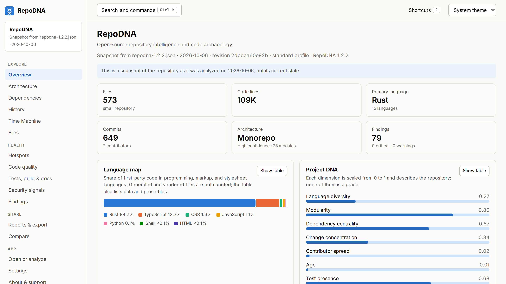
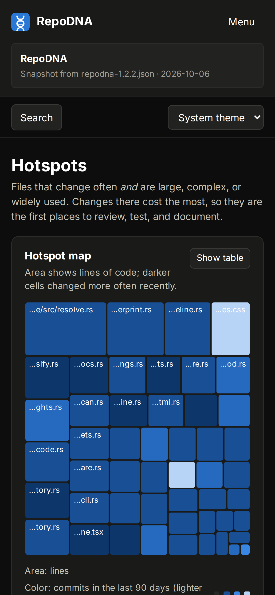

# RepoDNA 1.2.2

Released on 2026-10-07: [GitHub release](https://github.com/sanskarIN/RepoDNA/releases/tag/v1.2.2) · [changes since 1.2.1](https://github.com/sanskarIN/RepoDNA/compare/v1.2.1...v1.2.2) · [source code at v1.2.2](https://github.com/sanskarIN/RepoDNA/tree/v1.2.2).

A small follow-up to 1.2.1: the shade on tables that scroll sideways on phones shows along
the whole edge, and the npm packages of older releases can be published to npmjs.com,
which put 1.2.0 there too. The notes of this release show its screenshots.

## What changed

### Fixed

- On phones, the shade on the edge of a table that scrolls sideways is as strong at the
  top of the table as in its middle. In 1.2.1 it faded toward the top and bottom of long
  tables, so the first rows showed almost none.
- The npm packages workflow can publish a release older than the newest one, such as
  1.2.0 after 1.2.1. npm refused to give it the `latest` tag; it now goes under the
  `previous` tag, and `latest` stays on the newest release. 1.2.0 is on npmjs.com this
  way, so `npm install --global @sanskarin/repodna@1.2.0` works without a token too.

### Documentation

- Screenshots of 1.2.1 and 1.2.2 in [`docs/images`](../../images/README.md), and the
  promo images and Project DNA cards of 1.2.1 in
  [`docs/media/v1.2.1`](../../media/README.md). Each release has a folder of its own in
  the media kit, and the README and the guides show the screenshots of 1.2.2.
- The notes of a release on GitHub show its screenshots, when its tag has them.
- A page for 1.2.1 in [`docs/releases`](../README.md), with its downloads and their sizes.
- The installation guide and the 1.2.0 release page say that 1.2.0 is on npmjs.com too.

## Downloads

The files are attached to the [GitHub release](https://github.com/sanskarIN/RepoDNA/releases/tag/v1.2.2).

| File | What it is | Size |
|---|---|---|
| [`repodna-1.2.2-x86_64-unknown-linux-musl.tar.gz`](https://github.com/sanskarIN/RepoDNA/releases/download/v1.2.2/repodna-1.2.2-x86_64-unknown-linux-musl.tar.gz) | Command line for Linux, x86_64 (static) | 11.5 MB |
| [`repodna-1.2.2-aarch64-unknown-linux-musl.tar.gz`](https://github.com/sanskarIN/RepoDNA/releases/download/v1.2.2/repodna-1.2.2-aarch64-unknown-linux-musl.tar.gz) | Command line for Linux, ARM64 (static) | 10.7 MB |
| [`repodna-1.2.2-aarch64-apple-darwin.tar.gz`](https://github.com/sanskarIN/RepoDNA/releases/download/v1.2.2/repodna-1.2.2-aarch64-apple-darwin.tar.gz) | Command line for macOS, Apple silicon | 10.4 MB |
| [`repodna-1.2.2-x86_64-apple-darwin.tar.gz`](https://github.com/sanskarIN/RepoDNA/releases/download/v1.2.2/repodna-1.2.2-x86_64-apple-darwin.tar.gz) | Command line for macOS, Intel | 11.0 MB |
| [`repodna-1.2.2-x86_64-pc-windows-msvc.zip`](https://github.com/sanskarIN/RepoDNA/releases/download/v1.2.2/repodna-1.2.2-x86_64-pc-windows-msvc.zip) | Command line for Windows, x86_64 | 11.0 MB |
| [`RepoDNA_1.2.2_amd64.deb`](https://github.com/sanskarIN/RepoDNA/releases/download/v1.2.2/RepoDNA_1.2.2_amd64.deb) | Desktop app for Debian and Ubuntu | 12.0 MB |
| [`RepoDNA-1.2.2-1.x86_64.rpm`](https://github.com/sanskarIN/RepoDNA/releases/download/v1.2.2/RepoDNA-1.2.2-1.x86_64.rpm) | Desktop app for Fedora and openSUSE | 12.0 MB |
| [`RepoDNA_1.2.2_universal.dmg`](https://github.com/sanskarIN/RepoDNA/releases/download/v1.2.2/RepoDNA_1.2.2_universal.dmg) | Desktop app for macOS (Apple silicon and Intel) | 21.3 MB |
| [`RepoDNA_1.2.2_x64_en-US.msi`](https://github.com/sanskarIN/RepoDNA/releases/download/v1.2.2/RepoDNA_1.2.2_x64_en-US.msi) | Desktop app for Windows (MSI installer) | 11.5 MB |
| [`RepoDNA_1.2.2_x64-setup.exe`](https://github.com/sanskarIN/RepoDNA/releases/download/v1.2.2/RepoDNA_1.2.2_x64-setup.exe) | Desktop app for Windows (setup program) | 7.6 MB |
| [`SHA256SUMS.txt`](https://github.com/sanskarIN/RepoDNA/releases/download/v1.2.2/SHA256SUMS.txt) | SHA-256 checksums of every file | 1.0 kB |

Also published for this version:

- `ghcr.io/sanskarin/repodna:1.2.2`: the command line with Git, for `linux/amd64` and `linux/arm64`.
- `ghcr.io/sanskarin/repodna-web:1.2.2`: the web interface, served on port 8080.
- `@sanskarin/repodna@1.2.2` (the command line, with one package per platform), `@sanskarin/repodna-schema@1.2.2`, and `@sanskarin/repodna-visualization@1.2.2` on npmjs.com, with provenance, and on the npm registry of GitHub Packages.

## Install this version

```sh
# With npm, from npmjs.com
npm install --global @sanskarin/repodna@1.2.2

# Linux, x86_64
curl -LO https://github.com/sanskarIN/RepoDNA/releases/download/v1.2.2/repodna-1.2.2-x86_64-unknown-linux-musl.tar.gz
tar -xzf repodna-1.2.2-x86_64-unknown-linux-musl.tar.gz
sudo install -m 0755 repodna-1.2.2-x86_64-unknown-linux-musl/repodna /usr/local/bin/repodna

# From source, with a Rust toolchain
cargo install --git https://github.com/sanskarIN/RepoDNA --tag v1.2.2 --locked repodna-cli

# In a container
docker run --rm -v "$PWD:/work" ghcr.io/sanskarin/repodna:1.2.2 analyze .
```

The [installation guide at v1.2.2](https://github.com/sanskarIN/RepoDNA/blob/v1.2.2/docs/installation.md) covers every
platform, checking the downloads against `SHA256SUMS.txt`, and opening the unsigned
binaries on macOS and Windows.

## Screenshots

<a href="../../images/v1.2.2/desktop/overview-light.png"></a> <a href="../../images/v1.2.2/phone/hotspots-dark.png"></a>

Twelve desktop views, eight phone screens, and two views of the desktop app, showing this
version's own analysis of this repository at `v1.2.2`, are in
[`docs/images/v1.2.2`](../../images/README.md#122).

## Images

1.2.2 is a small follow-up, so it has no promo images of its own; those of 1.2.1 are in the
[media kit](../../media/README.md).

[All releases](../README.md)
