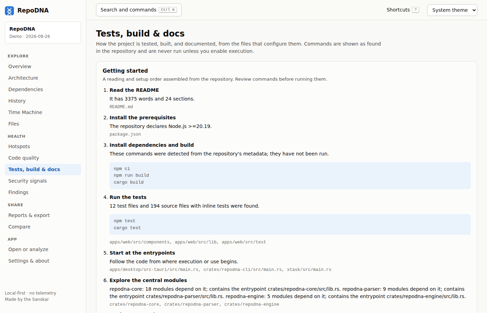

# Tests, build, and documentation

The project stage answers the practical questions a newcomer asks: how is this built, how
is it tested, what does it need, and where is it documented? Everything is read from files
and manifests. Commands are **detected, never run**, unless you enable execution.

```sh
repodna show --section tests,build,documentation
```



## Tests

- **Test files** are recognized by path and file-name conventions (`tests/`, `__tests__/`,
  `spec/`, `*_test.go`, `test_*.py`, `*.test.ts`, `*Test.java`, and so on) and by inline
  test markers such as Rust `#[cfg(test)]` modules.
- **Frameworks** are detected from dependencies, configuration files, and conventions,
  including Jest, Vitest, Mocha, Jasmine, AVA, Karma, Cypress, Playwright, Testing Library,
  pytest, unittest, Hypothesis, tox, nox, JUnit, TestNG, Kotest, Go testing, the Rust test
  harness, RSpec, Minitest, PHPUnit, Pest, xUnit.net, NUnit, MSTest, XCTest, GoogleTest,
  and Flutter test.
- **Test commands** come from package scripts, Makefiles, task runners, and ecosystem
  conventions (`cargo test`, `go test ./...`, `npm test`, `pytest`, ...).
- **Coverage reports** that are committed are listed.
- **CI**: whether a CI configuration appears to run the tests.

The share of test code says where tests exist, not how much behavior they cover.

Rules: `tests.none`, `tests.low-ratio`, `tests.not-in-ci`, and `tests.coverage-committed`.

## Build

- **Build systems and tools**, including Cargo, npm, pnpm, Yarn, Vite, Rollup, Next.js,
  Nuxt, SvelteKit, Astro, Angular CLI, Nx, Turborepo, Lerna, Deno, Electron, Tauri, Go
  modules, Maven, Gradle, Poetry, Hatch, PDM, Pipenv, Flit, Maturin, Bundler, Rake,
  Composer, Dart pub, Flutter, Swift Package Manager, Xcode, CMake, Meson, Autotools, Make,
  Bazel, SCons, Nix, Just, and Task.
- **Commands** for installing, building, testing, linting, formatting, running, starting a
  development server, and benchmarking, each
  with its source (for example `web/package.json scripts.build` or `Makefile test`) and the
  directory it runs in.
- **CI systems**: GitHub Actions, GitLab CI, CircleCI, Azure Pipelines, Jenkins, Travis CI,
  Bitbucket Pipelines, Drone, and Buildkite, with their job names.
- **Containers**: Dockerfiles and Compose files.
- **Environment requirements**: toolchains, runtimes, SDKs, and package managers declared
  by the project, such as a Rust or Go version, Node.js `engines`, or `requires-python`.

Rule: `build.no-ci`.

## Running commands

RepoDNA can run the detected commands to check that they work, but only when you allow it
in your **user configuration** (a repository's `repodna.toml` cannot):

```toml
[execution]
allow_build_commands = true   # the first detected install command, then the first build command
allow_test_commands = true    # the first detected test command
timeout_seconds = 600
max_output_lines = 200
```

- Commands run in the repository without a shell: the command line is split on whitespace,
  and `&&` chains run step by step. Commands that use other shell operators (pipes,
  redirections, `;`, and so on) are refused.
- Each run has a time limit, stops when you cancel, runs non-interactively (`CI=true`, no
  standard input), and keeps only the last lines of output, with likely secrets redacted.
- A command that succeeds is marked *verified*; a failure is reported with its exit code and
  the end of its output. If installing fails, building is not attempted.
- **The commands run with your permissions and can do anything the repository's build can
  do**, including downloading packages and writing files into the checkout. Enable execution
  only for repositories you trust.

## Documentation

RepoDNA checks for the documents a project usually needs, and reads the README:

| Check | Looks for |
|---|---|
| README | A README at the root, with its length, headings, code blocks, links, and images |
| License | A license file or a license declared in a manifest, identified by SPDX identifier when possible |
| Installation and usage instructions | README sections about installing and using the project |
| Contributing guide, Code of conduct, Security policy, Changelog, Support information | `CONTRIBUTING`, `CODE_OF_CONDUCT`, `SECURITY`, `CHANGELOG`, and `SUPPORT` files |
| Code owners, Citation file | `CODEOWNERS` and `CITATION` files |
| Documentation directory, Examples | A `docs/` directory and an `examples/` directory |
| Issue templates, Pull request template | Templates in `.github/` |

The documentation dimension of the [DNA fingerprint](repository-dna.md#the-dna-fingerprint)
is the share of these checks that are met.

Rules: `docs.readme-missing`, `docs.readme-short`, `docs.setup-instructions`,
`docs.license-missing`, `docs.license-file-missing`, and `docs.optional-missing`.
