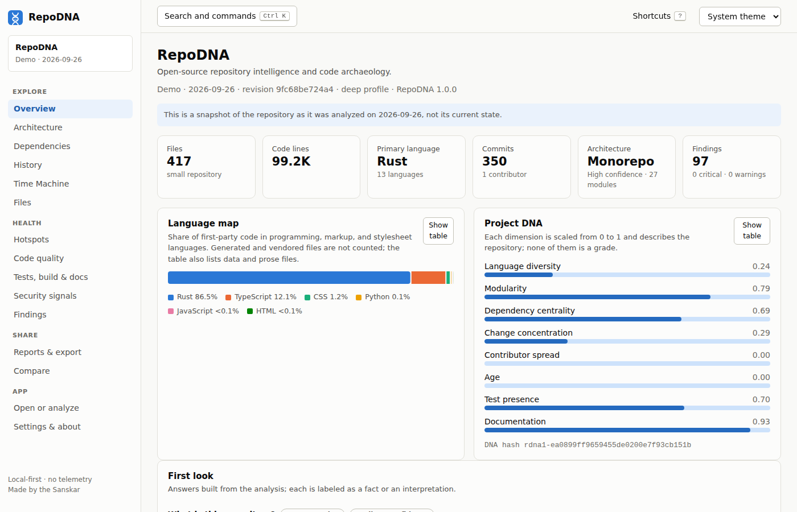

# The web interface

The web interface is the interactive way to explore an analysis: an overview, an
architecture map, history charts, the Time Machine, file and symbol browsers, hotspots,
quality and security signals, findings with their evidence, reports, and comparisons. The
same interface runs in three places:

| Where | How | What it can do |
|---|---|---|
| `repodna serve` | A local server on 127.0.0.1 | Browse stored analyses, start new ones, download reports |
| The [desktop app](desktop.md) | A native window | The same, with native folder pickers and save dialogs |
| The [web version](https://sanskarin.github.io/RepoDNA/), or any static web server | The built files in `apps/web/dist` | Open the bundled demo and analysis files; no stored analyses or new scans |



## Start it

```sh
repodna serve
```

```text
RepoDNA is listening on http://127.0.0.1:7878 (this machine only).

Open this link to sign in. It contains your session token, so do not share it:
  http://127.0.0.1:7878/?token=...

Press Ctrl+C to stop.
```

Open the printed link. The start page lets you:

- **Analyze a repository**: a local directory, a `.zip` or `.tar.gz` archive, or a Git URL,
  with a profile. Progress is shown while it runs, and the result is stored.
- **Open a stored analysis** from this machine.
- **Open an analysis file** (`repodna.json` or `.repodna`), by choosing it or dropping it
  on the page. The file is read locally and never uploaded.
- **Try the demo**: RepoDNA's analysis of its own repository, bundled with the interface.

`repodna serve --no-scan` disables starting analyses from the browser, and
`repodna serve --port 0` picks a free port.

## Views

| View | What it shows |
|---|---|
| Overview | Identity, size, languages, the DNA fingerprint, answers to first questions (what is this, where does it start, how is it built and tested), and the most important findings |
| Architecture | Modules and the dependencies between them as a layered graph, with layers, cycles, entry points, and module details |
| Dependencies | Ecosystems, manifests, lockfiles, declared packages, and dependency signals |
| History | Commit activity over time, contributors, releases, quiet periods, and change hotspots |
| Time Machine | Snapshots of the repository at points in its history, epochs, events, and the project story |
| Files | Every file with its language, category, size, and lines, and the symbols found in it |
| Hotspots | Files ranked by change frequency and complexity, with the reasons |
| Code quality | Complexity, long functions, deep nesting, duplication, similar files, markers, and dead-code candidates |
| Tests, build & docs | Test files and frameworks, build systems, detected commands, CI, environment requirements, and documentation checks |
| Security signals | Possible secrets, risky patterns, and permissions |
| Findings | Every finding with its evidence, method, and limitations, filtered by severity and category and searchable by title, rule, path, and evidence |
| Reports & export | The HTML report, the Markdown report, and the JSON artifact with a theme and privacy preset, and the DNA card in light or dark; the desktop app also saves the full report folder |
| Compare | This analysis next to another one |
| Settings | Theme, privacy notes, keyboard shortcuts, and version information |
| About & support | The version, ways to support RepoDNA, the project's links, and the legal documents |
| Privacy Policy, Terms of Use, Licenses | The policies, RepoDNA's license, and the licenses of the third-party software it includes, linked at the bottom of the sidebar |

Every chart has a table view, and severity is always written out, never shown by color
alone.

## Search and keyboard shortcuts

| Keys | Action |
|---|---|
| Ctrl/Cmd + K | Search views, files, modules, packages, and findings; run commands |
| Ctrl/Cmd + P | Quick open a file or module |
| Ctrl/Cmd + F | Search the current view (when it has a search box) |
| ↑ / ↓ and Enter | Move through results and choose one |
| Esc | Close a dialog |
| ? | Show the shortcuts |

The theme follows your system setting unless you choose light or dark in the header.

## Security

The server is meant for one person on one machine:

- It listens on **127.0.0.1 only**.
- Every API request needs the **session token**, either in the `X-RepoDNA-Token` header or
  in the `SameSite=Strict`, `HttpOnly` cookie set when you open the printed link. A new
  token is generated each time the server starts.
- Requests with a `Host` header other than the server's own address are refused, which
  defeats DNS rebinding.
- Requests that change something (starting or cancelling an analysis) are refused when
  their `Origin` is another site.
- Responses carry a restrictive Content Security Policy, and the interface loads nothing
  from other sites.

The interface's own files contain no data and are served without the token; everything
about your repositories comes from the API.

## The local API

Everything the interface shows comes from a JSON API, which you can also use from scripts.
Pass the token printed by `repodna serve`:

```sh
TOKEN=...   # from the printed link
curl -s -H "X-RepoDNA-Token: $TOKEN" http://127.0.0.1:7878/api/repositories
```

| Method and path | Returns |
|---|---|
| `GET /api/health` | `{"status": "ok", "version": ...}`; needs no token |
| `GET /api/session` | Version and whether analyses can be started |
| `GET /api/repositories` | Stored repositories |
| `GET /api/repositories/{id}` | One repository with its analyses |
| `GET /api/repositories/{id}/artifact` | The latest analysis artifact (`?scan=` picks another) |
| `GET /api/repositories/{id}/{view}` | One part of the artifact: `architecture`, `dependencies`, `history`, `hotspots`, `timeline`, `findings`, `insights`, `fingerprint`, `metrics`, `structure`, or `languages` |
| `GET /api/repositories/{id}/report` | A report: `?format=html\|markdown\|json`, `&theme=`, `&privacy=` |
| `GET /api/repositories/{id}/card.svg` | The DNA card (`?dark=1` for the dark palette) |
| `GET /api/compare?repositories={id},{id}` | A comparison |
| `GET /api/scans` | Analyses started from the interface |
| `POST /api/scans` | Start an analysis: `{"input": "path, archive, or URL", "profile": "standard"}` |
| `GET /api/scans/{id}` | Progress of one analysis |
| `DELETE /api/scans/{id}` | Cancel it |

`{id}` is a repository identifier, name, or path, as for `repodna` targets. The artifact
format is described by [`schemas/repodna-artifact.schema.json`](../schemas/repodna-artifact.schema.json).

## The web version

<https://sanskarin.github.io/RepoDNA/> is the interface hosted on GitHub Pages. It opens the
bundled demo and analysis files you choose (`repodna.json` from `repodna analyze --format
json` or `repodna report`, or a `.repodna` export); files are read in the page and never
uploaded. To analyze a repository, use the command line or the desktop app, then open the
result here or share it with others.

The [Web version workflow](../.github/workflows/pages.yml) builds and publishes it whenever
the interface changes on `main`, and can be started by hand from the Actions tab. GitHub
Pages must be turned on once, in the repository's **Settings > Pages**, with **GitHub
Actions** as the source.

## Hosting the interface yourself

The build in `apps/web/dist` uses relative paths and hash-based routing, so any static web
host can serve it from any path, with no server configuration:

```sh
npm ci
npm run build -w @repodna/web
npm run preview -w @repodna/web      # or serve apps/web/dist with any static file server
```

On a hosting service such as Cloudflare Pages, Netlify, or Vercel, use
`npm ci && npm run build -w @repodna/web` as the build command and `apps/web/dist` as the
output directory. The build includes `LICENSE.txt`, `NOTICE.txt`, and
`THIRD-PARTY-NOTICES.txt`, which the Licenses page shows.

## Developing the interface

See [development](development.md#the-web-interface).
