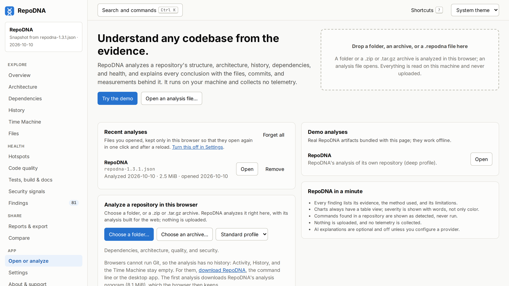

# The web interface

The web interface is the interactive way to explore an analysis: an overview, an
architecture map, history charts, the Time Machine, file and symbol browsers, hotspots,
quality and security signals, findings with their evidence, reports, and comparisons. The
same interface runs in three places:

| Where | How | What it can do |
|---|---|---|
| `repodna serve` | A local server on 127.0.0.1 | Browse stored analyses, start new ones, download reports |
| The [desktop app](desktop.md) | A native window | The same, with native folder pickers and save dialogs |
| The [web version](https://sanskarin.github.io/RepoDNA/), or any static web server | The built files in `apps/web/dist` | Analyze a folder or an archive in the browser, without Git history; open analysis files and the bundled demo; make reports and DNA cards; works offline once opened. No stored analyses |


## Start it

```sh
repodna serve
```

```text
RepoDNA is listening on http://127.0.0.1:7878 (this machine only).

Open this link to sign in. It contains your session token, so do not share it:
  http://127.0.0.1:7878/?token=...

Press Ctrl+C to stop.
```

Open the printed link. The start page lets you:

- **Analyze a repository**: a local directory, a `.zip` or `.tar.gz` archive, or a Git URL,
  with a profile. Progress is shown while it runs, and the result is stored.
- **Open a stored analysis** from this machine. With more than eight, the newest are
  listed first, and a filter finds the others by name or location.
- **Open an analysis file** (`repodna.json` or `.repodna`), by choosing it or dropping it
  anywhere on the page, also while another analysis is open. The file is read locally and
  never uploaded.
- **Open a recent analysis**: the last five files you opened, kept in this browser so that
  they open again in one click. Remove them one by one, or forget them all or turn this off
  in Settings.
- **Try the demo**: RepoDNA's analysis of its own repository, bundled with the interface.

In the web version, **Analyze a repository in this browser** takes the place of the first
item: see [the web version](#the-web-version).

Reloading the page keeps the analysis and the view you had open, in the web version too.
A new tab starts on the start page.

`repodna serve --no-scan` disables starting analyses from the browser, and
`repodna serve --port 0` picks a free port.

## Views

| View | What it shows |
|---|---|
| Overview | Identity, size, languages, the DNA fingerprint, answers to first questions (what is this, where does it start, how is it built and tested), and the most important findings |
| Architecture | Modules and the dependencies between them as a layered graph, with layers, cycles, entry points, and module details |
| Dependencies | Ecosystems, manifests, lockfiles, declared packages, and dependency signals |
| History | Commit activity over time, contributors, releases, quiet periods, and change hotspots |
| Time Machine | Snapshots of the repository at points in its history, epochs, events, and the project story |
| Files | Every file with its language, category, size, and lines, and the symbols found in it |
| Hotspots | Files ranked by change frequency and complexity, with the reasons |
| Code quality | Complexity, long functions, deep nesting, duplication, similar files, markers, and dead-code candidates |
| Tests, build & docs | Test files and frameworks, build systems, detected commands, CI, environment requirements, and documentation checks |
| Security signals | Possible secrets, risky patterns, and permissions |
| Findings | Every finding with its evidence, method, and limitations, 25 at a time, filtered by severity and category and searchable by title, rule, path, and evidence |
| Reports & export | The HTML report, the Markdown report, and the JSON artifact with a theme and privacy preset, and the DNA card in light or dark, as SVG or PNG; the desktop app also saves the full report folder. In the web version, they are made in the browser |
| Compare | This analysis next to another one: a stored analysis, a file you choose or drop on its drop zone, or the demo |
| Settings | Theme, recent analyses, privacy notes, keyboard shortcuts, and version information |
| About & support | The version, ways to support RepoDNA, the project's links, and the legal documents |
| Privacy Policy, Terms of Use, Licenses | The policies, RepoDNA's license, and the licenses of the third-party software it includes, linked at the bottom of the sidebar |

Every chart has a table view, and severity is always written out, never shown by color
alone. **Download CSV** under a table saves all of its rows, in the order shown, for a
spreadsheet: numbers stay numbers, and text that a spreadsheet would run as a formula is
written so that it does not run.

To print a view, or save it as PDF, use the browser's Print command, or **Print this view**
in the command palette (Ctrl/Cmd + K), which the desktop app needs, having no print menu.
The printout leaves out the buttons and links made for the screen, shows every column of
wide tables, and is in the light theme whatever the theme on screen.

### Finding your way

- The numbers at the top of the overview open the view about them: files, code lines,
  commits, the architecture style, and findings.
- A view with four panels or more lists them under its title; choose one to go to it.
- Under each view, links lead to the previous and the next view, so an analysis can be read
  from the overview to the comparison. The `[` and `]` keys do the same.
- On a long page, **Back to top** appears at the bottom right once you have scrolled down.
- The sidebar shows how many findings the analysis has. Findings can also be opened
  filtered, for example `#/findings?severity=warning` or `#/findings?category=security`.

## Search and keyboard shortcuts

| Keys | Action |
|---|---|
| Ctrl/Cmd + K | Search views, files, modules, packages, and findings; run commands, such as printing the view |
| Ctrl/Cmd + P | Quick open a file or module |
| Ctrl/Cmd + F | Search the current view (when it has a search box) |
| ↑ / ↓ and Enter | Move through results and choose one |
| [ and ] | Go to the previous or next view of an analysis |
| Esc | Close a dialog |
| ? | Show the shortcuts |

The theme follows your system setting unless you choose light or dark in the header.

## Security

The server is meant for one person on one machine:

- It listens on **127.0.0.1 only**.
- Every API request needs the **session token**, either in the `X-RepoDNA-Token` header or
  in the `SameSite=Strict`, `HttpOnly` cookie set when you open the printed link. A new
  token is generated each time the server starts.
- Requests with a `Host` header other than the server's own address are refused, which
  defeats DNS rebinding.
- Requests that change something (starting or cancelling an analysis) are refused when
  their `Origin` is another site.
- Responses carry a restrictive Content Security Policy, and the interface loads nothing
  from other sites.

The interface's own files contain no data and are served without the token; everything
about your repositories comes from the API.

## The local API

Everything the interface shows comes from a JSON API, which you can also use from scripts.
Pass the token printed by `repodna serve`:

```sh
TOKEN=...   # from the printed link
curl -s -H "X-RepoDNA-Token: $TOKEN" http://127.0.0.1:7878/api/repositories
```

| Method and path | Returns |
|---|---|
| `GET /api/health` | `{"status": "ok", "version": ...}`; needs no token |
| `GET /api/session` | Version and whether analyses can be started |
| `GET /api/repositories` | Stored repositories |
| `GET /api/repositories/{id}` | One repository with its analyses |
| `GET /api/repositories/{id}/artifact` | The latest analysis artifact (`?scan=` picks another) |
| `GET /api/repositories/{id}/{view}` | One part of the artifact: `architecture`, `dependencies`, `history`, `hotspots`, `timeline`, `findings`, `insights`, `fingerprint`, `metrics`, `structure`, or `languages` |
| `GET /api/repositories/{id}/report` | A report: `?format=html\|markdown\|json`, `&theme=`, `&privacy=` |
| `GET /api/repositories/{id}/card.svg` | The DNA card (`?dark=1` for the dark palette) |
| `GET /api/compare?repositories={id},{id}` | A comparison |
| `GET /api/scans` | Analyses started from the interface |
| `POST /api/scans` | Start an analysis: `{"input": "path, archive, or URL", "profile": "standard"}` |
| `GET /api/scans/{id}` | Progress of one analysis |
| `DELETE /api/scans/{id}` | Cancel it |

`{id}` is a repository identifier, name, or path, as for `repodna` targets. The artifact
format is described by [`schemas/repodna-artifact.schema.json`](../schemas/repodna-artifact.schema.json).

## The web version

<https://sanskarin.github.io/RepoDNA/> is the interface hosted on GitHub Pages. It analyzes
repositories itself, in the browser, with RepoDNA's analysis built as WebAssembly (the same
Rust code as the command line, as the
[`@sanskarin/repodna-wasm`](installation.md#npm-packages) package publishes it):

- **Choose a folder** or **Choose an archive** (`.zip`, `.tar`, `.tar.gz`, or `.tgz`) on the
  start page, or drop one anywhere on the page, and pick a profile. The start page shows
  each stage as it runs and the files done, with **Stop**. The finished analysis opens like
  an analysis file and is kept with the recent analyses.
- Files are read in the page, only when the analysis opens them, so files that
  `.gitignore` excludes are never read, and nothing is uploaded. The repository's own
  `repodna.toml` applies, as on the command line.
- Browsers cannot run Git, so these analyses have no history: no commits, contributors,
  hotspots by change, or Time Machine. For those, use the command line or the desktop app,
  then open the result here.
- The first analysis downloads the analysis program, about 3 MB compressed, which the
  browser then keeps.



It also opens the bundled demo and analysis files you choose (`repodna.json` from
`repodna analyze --format json` or `repodna report`, or a `.repodna` export), and on
**Reports & export** makes the HTML and Markdown reports and the Project DNA card of an
open analysis, as SVG or PNG, the same way. Files are read in the page and never uploaded.

Once opened, the web version keeps working without a connection: it keeps its page, its
files, and the demo in the browser, and the analysis program once it has been used. A new
version takes effect on the next visit online.

Browsers that can install web sites as apps, such as Chrome, Edge, and Safari, can install
the web version (in Chrome, **Install RepoDNA** in the address bar or the menu; in Safari,
**Add to Dock** or **Add to Home Screen**). It then opens in a window of its own, and in
Chrome and Edge on a computer it can be chosen to open `.repodna` files from the file
manager.

The [Web version workflow](../.github/workflows/pages.yml) builds and publishes it whenever
the interface changes on `main`, and can be started by hand from the Actions tab. GitHub
Pages must be turned on once, in the repository's **Settings > Pages**, with **GitHub
Actions** as the source. With **Deploy from a branch** instead, GitHub also builds the
branch on every push to `main` and publishes the repository's own files over the
interface, so visitors get the README. The workflow then publishes the interface again as
soon as that build finishes, and its runs carry a warning until the source is switched to
**GitHub Actions**, which keeps the README from showing at all.

## Hosting the interface yourself

The quickest way is the container image that each release publishes, with the interface
already built and served by nginx on port 8080:

```sh
docker run --rm -p 8080:8080 ghcr.io/sanskarin/repodna-web
```

See [the web interface image](installation.md#web-interface-image). With Node.js 18 or
later instead, the `@sanskarin/repodna-web` npm package serves the same interface on this
machine, at <http://127.0.0.1:8080/> (`--port` and `--host` change where):

```sh
npx @sanskarin/repodna-web
```

To build it yourself, note that the build in `apps/web/dist` uses relative paths and
hash-based routing, so any static web host can serve it from any path, with no server
configuration. To analyze in the browser, it needs the WebAssembly program, built first
and named by `REPODNA_ENGINE`; without it, the web version opens files only:

```sh
npm ci
rustup target add wasm32-wasip1
cargo build --locked -p repodna-wasm --target wasm32-wasip1 --profile web-engine
REPODNA_ENGINE=target/wasm32-wasip1/web-engine/repodna-wasm.wasm npm run build -w @repodna/web
npm run preview -w @repodna/web      # or serve apps/web/dist with any static file server
```

A server that sends its own Content Security Policy must allow `'wasm-unsafe-eval'` in
`script-src`, as the interface's own policy does, and should send `.wasm` files as
`application/wasm`.

On a hosting service such as Cloudflare Pages, Netlify, or Vercel, use
`npm ci && npm run build -w @repodna/web` as the build command and `apps/web/dist` as the
output directory. The build includes `LICENSE.txt`, `NOTICE.txt`, and
`THIRD-PARTY-NOTICES.txt`, which the Licenses page shows.

## Developing the interface

See [development](development.md#the-web-interface).
